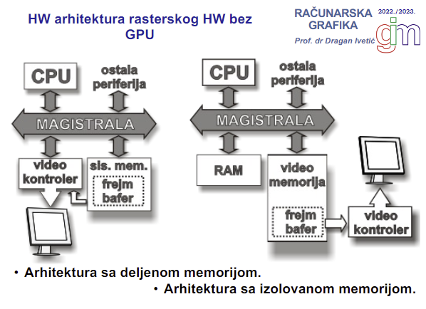
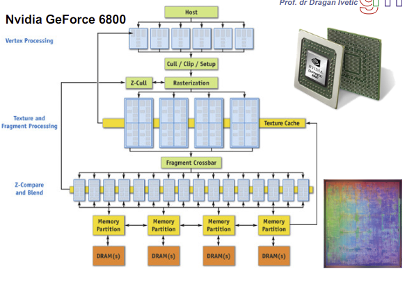

# Ponavljanje
### Arhitektura rasterskog hardvera bez GPU

- Rasterska arhitektura je kompleksnija i radi na nivou piksela
- Rasterski hardver se realizuje
    - bez gpu (deljena ili izolovana memorija)
    - sa gpu (deljena ili izolovana memorija)
- Izolovana je video memorija, deljena je sve zajedno u RAM-u
##### Proces
- Unesemo komande za ono sto zelimo da nacrtamo
- To preko magistrale ode u sistemsku memoriju 
- Iz sistemske memorije GPU uzima i cita te instrukcije (ako je izolovana memorija, on uzme iz sistemske i prebaci kod sebe) i pravi rasterski opis
- Rasterski opis nastaje tako sto se izvode pipeline operacije
- Rasterski opis se prebacuje u frame buffer
- Video kontroler cita iz frame buffera i prikazuje na monitoru
- Video kontroler klasicne arhitekture:
    -   U frame bufferu stoje 3 vrednosti za svaki piksel - boja
- Look Up Table arhitektura video kontrolera:
    -   Lookup buffer ocekuje da boja bude definisana u lookup tabeli, a frame buffer ima indekse iz lookup tabele
    -   Manje opterecujuci za memoriju, ali je sporiji (od klasicnog)

# Predavanje 4

## Tok rada graficke aplikacije
- Uvek vektorski opis ulazi, a rasterski opis izlazi jer je vektorski opis prirodniji coveku
1. Inicijalizacija API-ja
    - Ranije se sve radilo od nule, danas postoje biblioteke:
        - OpenGL - izasao iz najstarije biblioteke; prvi naslednik. OpenGL|ES - sto jednostavniji, bez icega, da bi mogao biti prenosiv u ves masine i takve manje uredjaje - skup rutina. WebGL - prilagodjen za HTML browsere (ne vole ga jer mora da pristupa hardveru sa weba - rizik)
        - DirectX - Microsoftova verzija OpenGL-a; napravio skup biblioteka za multimedijalni prikaz (Direct3D)
        - Vulkan - Razvio se pod OpenGL-om jer je OpenGL metodologija pocela da stari. Vulkan je OpenGL na mnogo nizem nivou, ali je fleksibilniji
        - Metal - Samo za Apple-ove platforme
2. Kreiranje aseta
    - Kreiranje struktura podataka za shader-e i ostale procese u grafickom pipeline-u
    - Punjenje komandnog bafera GPU-a za izvrsavanje
    - Slanje resursa u video memoriju GPU-a
3. Azuriranje aseta
    - Azuriranje uniform promenljivih shader-a
    - Smestanje aplikacione logike
4. Prezentacija
    - Slanje komandnih bafera u red
    - Prezentaciaj *swapchain* (?)
5. Kraj app? idi dalje, inace skoci na 2. 
6. Oslobodi
    - Cekamo da GPU sve zavrsi
    - Oslobadjamo memoriju koju smo koristili

## Razvoj grafickih API-ja
- Razvoj
    - IRISGL - prvi api razvijen 80ih godina; hteli su sebi da olaksaju posao
    - OpenGL - nastao 90ih
    - DirectX - od 96.
    - OpenGL|ES - od 2003.
    - Vulkan - od 2014.

## Graficki pipeline
- Opsti pipeline
    - Vertex processing (vertex shader)
        - Model & View transform, vertex shading, projection, clipping, screen mapping
    - Rasterizer
        - Culling, Triangle traversal, generisanje fragmenata
    - Fragment processing (fragment shader)
        - Koji piksel pripada kom fragmentu, blending
        - Mada bi trebalo da je rasterizer u fragment shaderu ali ok
- OpenGL 1.0
    - pipeline fiksne funkcije; moguce samo menjati atribute funkciej (koordinate, boju...)
    - Vertex transform and lightning -> Primitive setup and rasterization -> Fragment coloring and texturing -> Blending
    - Dozvoljava da mu na ulaz pored vertexa dodje i pixel data - moze raditi i nad slikama (teksture, geografske mape)
- OpenGL 2.0
    - Prosiruje obradu verteksa i fragmenata
    - Oficijalno dodao shadere (ako ih napravis, onda fiksni ne radi; ako ne, onda se fiksni pipeline izvrsava)
    - GLSL - OpenGL Shading Language
    - I dalje fiksna funkcija dominira
- Nvidia GeForce 6800
    *ne izgleda kao da je bitno*
    - Jedan od presudnih GPU-ova
    
    - Prvi plavi red obradjuju temena
    - Fiksni deo koji radi kliping pa salje na rasterizaciju
    - Duplo vise novih plavih delova - jer rade nad pikselima pa ih ima mnogo vise
- OpenGL 3.1
    - Obavezna upotreba vertex i fragment shadera
    - Svi vertex podaci se salju pomocu VBO (vertex buffer objects)
- OpenGL 3.2
    - Uvodi geometry shader - ne radimo vise samo nad temenima, nego sad mozemo nad odredjenim povrsinama (stripes, fans...)
    - Vertex shader -> Geometry shader -> Fragment shader
    - Problem na koji su naleteli:
        - Ako prikazujemo nesto, u jednom trenutku geometrija na sceni je veoma promenljiva -> mora biti puno trouglova, broj verteksa je veci
        - Ali isto tako, u nekom trenutku geometrija moze biti prosta, a broj boja veci -> malo verteksa, ali puno rada nad pikselima
        - U sustini, cas mnogo radi vertex shader, cas mnogo radi fragment shader. Zato sto ne mozemo da hladimo zasebne delove procesora, pametnije je **unify-ovati shadere**. Bolje hladjenje -> mozemo povecati frekvenciju :)
- OpenGL 3.3
    - Podrzava unified shader model GPU
- Nvidia GeForce 9800 GTX i GTX280
    - Sada graficka kartica moze da paralelizuje i mogu se izvrsavati operacije koje nisu vezane za grafiku (masinsko ucenje)
    - CUDA arhitektura - moj graficki procesor moze da radi i negraficke procese (CUDA compatible procesori). On moze da se poveze sa bilo kojim CUDA compatible CPU-om (dodatne nogice (:)) na procesoru)
    - APU - Accelerated processing unit. Kombinuje procesore u jedan chip - taj chip moze da radi i graficke operacije i cpu operacije
    - CUDA vs APU - CUDA je preovladala APU zbog modularnosti - menjam jednu komponentu ako crkne; kod APU menjam sve
- OpenGL 4.2
    - Najkompleksniji programabilni pipeline
    - Uvodi tesalacioni shader
    - Tesalacija se obavlja tandemskim radom dva shadera - upravljacki i evaluacioni
    - Tesalacija - povrsinu zamenimo sa vise manjih povrsinica (npr beton se zameni sarenim kamencicima)
    - Kontrolni - koliko novih temena da napravim?
    - Evaluacioni - procenjuje koliki broj temena je optimalno da napravi

Trougao je osnova racunarske grafike:
- Najmanje temena (najmanja povrsina sto se moze definisati)
- Mozemo sastaviti sve povrsine trouglovima
- Trougao je uvek planarna povrsina
- Konveksan