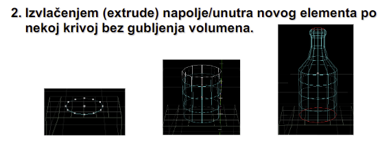
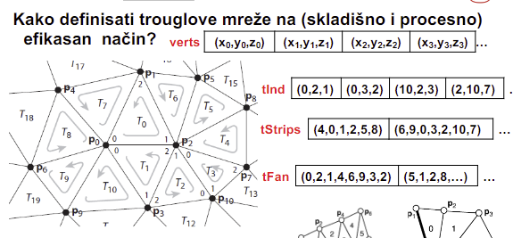
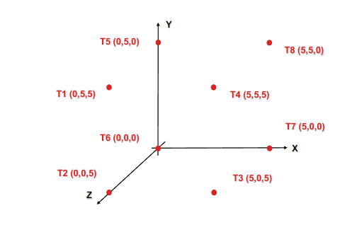

# Predavanje 5

## Modeli, prostori i transformacije
**Model Transform**
- Model se iz lokalnog sveta (model space) prebacuje na scenu (u world space)
- Izvori svetla se stavljaju na svoje pozicije (neka svetla ima smisla stavljati, neka smisla nema smisla stavljati - ambijentalno jer je uvek prisutno)
- Postavljaju se kamere na svoje pozicije

**View Transform**
- Izrazavamo sve objekte u koordinatni sistem kamere (camera space)
- Da korisnik dobije osecaj da iz te pozicije iz tog prostornog ugla gleda na svet
- Da bi se prebacilo u camera space, od koordinata svakog modela oduzmemo koordinate kamere

**Projection Transform**
- Ortogonalna ili perspektivna projekcija
- Clipping - iz idealnog kvadrata secemo sve sto se ne vidi iz kamere

**Viewport Transform**
- Screen mappingom mapiramo nas kvadrat na rezoluciju ekrana (ili prozora koji je korisnik otvorio)

## Modeli - 3D primitive
Kako napraviti 3D objekte/modele?
- Boundary representation
    - Najcesce se radi
    - Izmodelujemo samo spoljasnost, jer korisnik vidi samo spoljasnost
    - Samo "ljuska" objekta
    - Polygon mesh (najcesce; mreza poligona), Parametric patching (ne mora biti planarno; sastavljeno iz krivina), Implicit surfaces (cista matematika; implicitnim nacinom se definise telo)
- Solid modeling
    - Modelujemo ceo volumen (i spoljasnost i unutrasnjost)
- Spatial enumeration
    - Delimo prostor, odbacujuci ono sto nije objekat i zadrzavajuci ono sto je objekat (klesanje?)

Najmanja jedinica u 3D svetu - **Voksel**

**Poygon mesh**
- Skup ivica, temena i planarnih poligona spojenih tako da svaka ivica je deljena izmedju najvise dva susedna poligona, svaka tacka deljena izmedju barem 3 poligona, ivica povezuje dva temena, poligon je zatvorena sekvenca ivica i ima prednju i zadnju stranu
- **Winding** - navijanje
    - Bitna karakteristika
    - Pravilo desne ruke za normale - redosledom kojim definises temena trougla, definises pravac njegove normale
- Veca nepravilnost povrsine modela zahteva veci broj trouglova
- LOD - Level of Detail
    - LOD opada sa rastojanjem gledalac - objekat
    - LOD zavisi i od ugla gledanja na objekat, brzine objekta, konteksta scene, rezolucije projekcione povrsine...

##### Kako da napravim 3D model pomocu poligona sa odabranim LOD-om?
1. Generise se skup atacaka koji pripadaju povrsini objekta (rucno, matematikom ili skeniranjem)
2. Primeni se Delaunay-ova triangulacija
    - Izaberemo 3 temena i opisemo krug oko trougla
    - Ako unutar kruznice ili na kruznici ne upada nijedno drugo teme sem ta 3, onda je to dobar trougao - zadrzavamo ga

##### Mreza poligona - matematikom
1. Tela koja se dobijaju okretanjem krive oko neke ose su:
    - Sfera, cilindar, torus, konus...
2. Izvlacenjem (extrude) napolje/unutra novog elementa po nekoj krivoj bez gubljenja volumena
    - Na slici izvlacimo z, a pre kraja izvucemo z, a x i y smanjujemo
    

##### Mreza poligona - skeniranjem
1. 3D Face capture (opticko)
    - Skeniraju lice iz puno uglova (18 kamera)
2. Lasersko 3D skeniranje

##### Kako definisati trouglove mreze na efikasan nacin

##### Osnovne definicije trouglova
1. Liste (lists)
    - Temena (moramo uvek)
    - Indeksa (indeks svakog temena se ponavlja barem 3 puta ili vise - problem)
2. Trake (strips)
    - Resavaju problem indeksa - zapamtimo poslednja 2 temena i samo nadovezujemo trece teme kako bi sacinili trougao
    - Moramo da pazimo na koju stranu su navijeni trouglovi (rotiramo svaki drugi trougao)
3. Venitaltori (fans)
    - Jedno teme je deljeno izmedju vise trouglova (nema ponavljanja)
    - Komplikovano
    - Otvoreni i zatvoreni ventilatori (zatvoren se na kraju spoji, a otvoren ne)
    - Ne mozemo zatvorenim ventilatorima da opisemo bas svaki objekat
    - Prvo navedemo deljeno teme, pa redjamo temena dalje pazeci na navijanje (nema problema kao kod trake)
    - Da bi bio zatvoren, drugonavedeni element i poslednji element moraju biti isti

Organizujemo u topoloski mocnije celine zbog optimizacije

##### Predstaviti temena pomocu liste, ventilatora i trake

1. Lista
    -  Bice 12 elemenata (jer 6 strana * 2 trougla)
    - T241, T234, T384, T378, T758, T765, T615, T625, T451, T485, T273, T267
2. Trake
    - Moze i iz jedne trake, a moze i iz 2, 3
3. Ventilatori
    - Mozemo sa 2 ventilatora (presecemo po najvecoj dijagonali kocke)
    - Centralna temena su na toj dijagonali (4 i 6) i ventilatori su zatvoreni
    - 41237851, 62158732