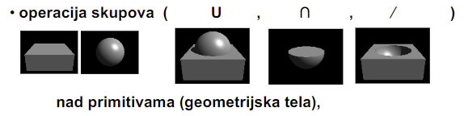

# Predavanje 6

### Implicitne povrsine
- Definisanje modela koriscenjem matematike
- Npr definisanje lopte sa
    - $x^2 + y^2 + z^2 = r^2$
- Uzmemo sve vertekse koji odgovaraju jednacini medjutim ovo je sporo. Mozemo ubrzati tako sto posmatramo opisanu kocku oko sfere jer tako ne moramo proci kroz sva temena (ali se ovo u praksi nikad ne radi)
- **Metaballs** - cesticna tela radijalne gustine ciju povrsinu cine cestice gustine odredjenog praga

- Te cestice se menjaju tako sto emituju cestice i onda zamrznu kada dostignu odredjeni uslov (PRAG) - odnosno kada dostignu neku **povrsinsku gustinu**, neka se onda ocvrsnu

- Lopte se spajaju tako sto jedna cestica emituje manje cestice koje se spajaju sa cesticama koje emituje druga lopta (jedna drugoj menjaju povrsinsku gustinu)
- Npr kad pravimo kapljice, uzmemo dve lopte, jedna sluzi da napravi ispupcenje drugoj lopti, a kazemo da se vizuelizuje samo druga lopta

### Parametrizovane zakrpe
- Parametrizovano - nesto opisujemo pomocu nekih parametara (npr ravan ima 3 parametra)
- 2D kriva:
    - $y = Ax^3 + Bx^2 + Cx + D$
- Jednostavnije parametarskom predstavom krive:
    - $x(t) = A_xt^3 + B_xt^2 + C_xt + D_x$
    - $y(t) = A_yt^3 + B_yt^2 + C_yt + D_y$
    - Razlozeno na funkciju promene x-a i funkciju promene y-a
    - Za $(x, y) = (cos(t), sin(t))$ se dobija kruznica
- 3D zakrpa izgleda ovako:
    

### Prostorna enumeracija
- Prostor se deli na manje cvrste pune delove koji tako formiraju 3D objekat
- Ti delovi su cesto kocke cija velicina odredjuje finocu modela
- 2D - QUADTREE
    - Deli se na 4 dela dok se ne dobije homogeni deo (potpuno van modela ili potpuno u modelu)
- 3D - OCTREE
    - Voxeli
    - Deli se na 8 delova (jos jedna osa) dok se ne dobije homogeni deo (potpuno van modela ili potpuno u modelu)
- Aliasing se koristi da se "zamazu" prelazi izmedju kockica

### Modelovanje punim telom
- Nastala od auto industrije (General Motors)
- Solid modeling - kreirali za CAD
- Radi po principu primene operacije skupova (unija, presek, razlika) nad primitivama

- Sweep - uzme se telo, definise se trajektorija; taj objekat krece da se pomera po trajektoriji i zamrzne se na svakom koraku i tako se dobije telo

- Kasnije dodati
    - Solid extrusion
        - Uzmemo model i izvucemo ga i time nastane novi model (krug izvuces dobijes cilindar)
        - Obicno za kreiranje osnovnih modela za nove gradnje
    - Cut/Slot extrusion
        - Provlacimo rupu kroz materijal odredjenom putanjom (nastane suplje telo)
        - Obicno za otvore, rupe, kljucaonice, zljebove...
    - Revolved extrusion
        - Uzmem krug i izvlacim u krug :) - dobijem krofnicu
        - Obicno za cevi, torusne oblike, rebra...
    - Revolved cut
        - Kao iznad, samo sto uzmem rupu i izvlacim u krug
        - Obicno za unutrasnje cevi, odlivke, hladjenje SUS motora (sus :))
    - Loft
        - Npr izvlacim trougao ka kruznici i polako se iz trougaonog preseka pojavljuje kruzni presek
        - Obicno za nove osnovne oblike sa topolski slicnim terminalima
    - Shell
        - Krenemo eroziju sa neke strane objekta dok ne dodju do odredjene debljine ostalih stranica (produbimo kao ciniju)
        - Obicno za solje, cinije, stvari sa tankim zidom

### 3D transformacije
- Da pozicioniramo, preoblikujemo i animiramo objekte, svetla i virtuelnu kameru u 3D prostoru
- Frustum - zasecena piramida
- Sve je mnozenje matrica
- Matrica P (projekcija) transformise view volume (kuboid ili frustum) na kanonski view volume (unit cube)
- Transformacija se primenjuje i na temena i na normalne (definisani 4D vekotirma)

##### Elementarne transformacije
- Translacije
- Rotacija
- Skaliranje - moze uniformno ili neuniformno
- Smicanje (shear) - objekat je zalepljen po jednoj ravni da se ne pomera, pa se pomera najcesce paralelno sa tom ravni

##### Primeri u 2D
- 2D translacija - vektor x y se sabere sa vektorom xt yt (pomera se)
- 2D skaliranje 
    - Vektor x y se pomnozi sa matricom Sx 0, 0 Sy
    - Uniformno Sx=Sy
    - Ako hocemo da smanjimo za pola, S treba biti 0.5. Ako zelimo da povecamo duplo vece, onda S treba da bude 2. Ako ostaje isto onda je S=1
    - Ako uvecamo, objekat krene da bezi od koordinatnog pocetka. Ako smanjimo, objekat se pribilizi koordinatnom pocetku. To popravljamo tako sto nakon skaliranja transliramo negativno da se vrati tamo gde je bio
- 2D rotacija
    - $x = r cos(\alpha)$
    - $y = r sin(\alpha)$
    - $x_t = xcos(\theta) - ysin(\theta)$
    - $y_t = xsin(\theta) + ycos(\theta)$
    - Dakle, za rotaciju $\theta$ moramo vektor x y pomnoziti sa matricom $cos(\theta),  -sin(\theta)$; $sin(\theta), cos(\theta)$
    - Ponovo problem: rotiramo samo oko koordinatnog pocetka. Mozemo resiti tako sto transliramo za -x -y u koordinatni pocetak, pa zarotiramo, pa vratimo. Medjutim, ovo nije efikasno

##### Homogenizacija
- Problem iznad resavamo tako sto "zakomplikujemo" - dodamo $w$ na koordinate
- $w \ge 1$ - uvek! Ako je $w=0$, koordinata (x, y, 0) je tacka u beskonacnosti - vektor u pravcu (x, y)
- $w$ odredjuje na kojoj smo ravni. Dakle:
    - $(x, y, 1) = (2x, 2y, 2) = (3x, 3y, 3)...$
- Primeri sa $w$

- Lako se paralelizuje i postaje brzo

- t1, t2, t3 -> translacija
- p1, p2, p3 -> projekcija
- $m_i$ -> skaliranje ili rotacija - ne znamo
- Deljenje svake koordinate sa $w$ se vracamo u normalan svet (normalizacija koordinata)
