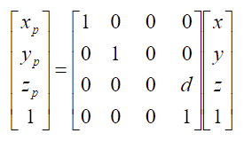
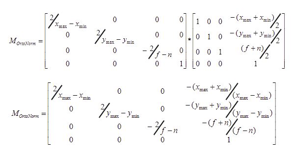
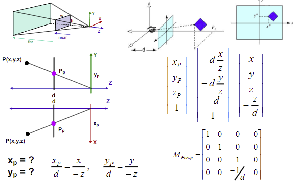
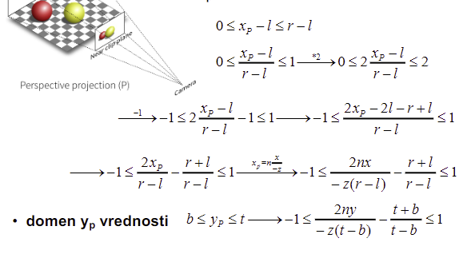
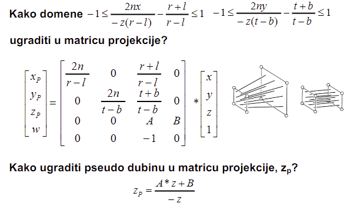

# Predavanje 7

## Kako deo 3D prostora prikazati na 2D

#### Ray tracing
- Kamera koja gleda na 3D svet, a izmedju se nalazi 2D ravan na koju treba da se projektuje 3D svet - projekcija iz perspektive (najprirodnije)
- Iz kamere krece prvi zrak i prolazi kroz prvi piksel. Kad on zavrsi svoj posao (nasao je boju u koju treba da se oboji taj piksel). Onda izadje drugi zrak kroz drugi piksel... itd
- Potrebna je opasna matematika da se nadje gde zrak dotacinje poligon i na kom mestu
- Iluminaciona formula - kako pojednostavljeno materijal reflektuje samo boju koju on ima. Cika Phong je ovo osmislio
- Zrak prodje, dotakne prvi objekat, sracuna se gde ga je dotakao, pusti to kroz formulu, on vrati boju piksela - pojednostavljena verzija
- Problemi: Vise objekata moze bacati senku na nas objekat; sta se desi ako pogodi senku? Kako mozemo proveriti da li je tacka u senci? - od te tacke odemo do svih izvora svetlosti, ako je nesto izmedju onda je u senci; ako je to slucaj onda samo smanjim malo boju. Sem senki, imamo i reflektujuce i transparentne objekte koji predstavljaju problem. Sta ako zrak udari o pod? - nebitno je da l je pod ili objekat, moramo i za pod sracunati boju. Sta ako zrak prodje i nista ne dodirne? - moramo definisati pozadinu. Sta ako tamo daleko dodirne neki objekat u vise tacaka? - uzimamo srednju vrednost (culling - izbacivanje po nekom kriterijumu; detailed culling)
- Kako bi ray tracing radio ortogonalnu projekciju? - pustimo zrake pod pravim uglom iz svakog piksela
- Ray tracing usput radi rasterizaciju, kliping, culling

#### Matrice projekcione transformacije
- 3D matricama projektujemo na 2D

Ray tracing je blizi non real-time grafici, dok su matrice blize real-time grafici

#### Projection pipeline
- Koordinate modela -> ModelView Transform -> Koordinate pogleda -> Projection Transform -> Normirane koordinate -> Projektovane normirane koordinate -> Viewport Transform (Screen mapping) -> Koordinate prozora

#### Klase projekcija
##### Planarna projekcija
- Paralelna
    - Ortogonalna
    - Kosa
        - Kavaljerska (fina); ugao od 45
        - Kabinetska (realna); ugao od 63.4
- Perspektivna
    - Iz jedne tacke - Center of Projection (COP)
    - Iz dve tacke - dodatno okrece projektovanu sliku u ravni
    - Iz tri tacke (retko)

#### Projekcija pogleda
- Zelimo generisati 2D sliku 3D scene iz ugla kamere
- Moramo projektovati objekte scene paralelno ili perspektivom
- Frustum - zasecena piramida
- Frustum svodimo na kuboid - pravimo gresku koja je blizu ivica (ali ono sto nas interesuje je u centru prikaza pa nije veliki problem)
- Bilo koju tacku P(x, y, z) projektovati na front -n (na blizu ravan; near)
- Uvedemo projekcionu ravan d: 0..-f (pomeramo udaljenost, u ovom slucaju je $d=-n$). Ova ravan nam treba da ne bismo sve projektovali na -n, nego da imamo neku razdaljinu
- To ce u sustini biti matrica sa 1 na glavnoj dijagonali sem kod z gde ce biti 0, ali ce poslednja vrednost u z redu biti d zato sto zelimo da ga skaliramo na -n

- OpenGL - centar je u sredini kocke i ide od -1 do 1
- Kako svesti kuboid na normiranu kocku? - transliramo kuboid da se nadje u centru i svodimo ga na jedinicni

- DirectX - Levo orijentisana biblioteka; max 1 1 1, min -1 -1 0

#### Projekcija u perspektivi na projekcionu ravan d

- $d=n$
- Domen $x_p$ vrednosti $l \le x_p \le r$

## Clipping
- Kliping i projekcija se mogu obavljati zajedno
- Kliping je algoritam, nema matrica!
- Moze analiticki da se pristupu - previse uzaludnog truda za mali (veliki) clipping prozor
- 2 algoritma (prvo radimo 2D pa onda 3D):
    - Cohen-Sutherlandov - klipuje linije
    - Sutherland-Hodgmanov - klipuje poligone (oslanja se na algoritam iznad)

#### Cohen-Sutherland
- Ideja: nas pravougaonik koji posmatramo - produzimo mu linije tako da deli canvas na 9 povrsina. Da li je linija u prozoru? ako jeste, prihvatam, ako nisi, odbacujem. Ako ti je deo u prozoru onda prihvatam deo. Za 9 ravni nam treba 4 bita. Svaka tetrada nam govori na kojoj povrsini se nalazi linija. Prva cifra govori da li je iznad ymax. Druga cifra govori da li je ispod ymin. Treca cifra govori da li je vece od xmax. Cetvrta cifra govori da li je manje od xmin. Do tetrade se dolazi **siftovanjem ulevo predznaka** $(ymax-y)$ pa $(y-ymin)$ pa $(xmax-x)$ pa $(x-xmin)$. Logicko AND nad tetradama tacka na krajevima linije; ako su sve nule onda ga razmatramo, ako ima barem jedna jedinica onda je napolju. Jednom operacijom zakljuci da li je cela linija napolju. $tetrada_A$ AND $tetrada_B \ne 0$ -> trivijalno neprihvatljiv. Kako sada da segmentiramo linije koje su delom u nasem pravougaoniku? - uzimamo najblize tacke kod presecne tacke linije i naseg pravougaonika

1. Prihvati trivijalnu untutrasnje i odbaci trivijalno spoljasnje linije
    - Trivijalno unutrasnje:
        - $XmaxLinija<Xmax, XminLinija > Xmin$
        - $YmaxLinija<Ymax, YminLinija > Ymin$
    - Kako trivijalno spoljasnje?
2. Prihvati delove ostalih linija koje se nalaze unutar prozora, podela na (pri) horizontalnim (vertikalanim) linijama