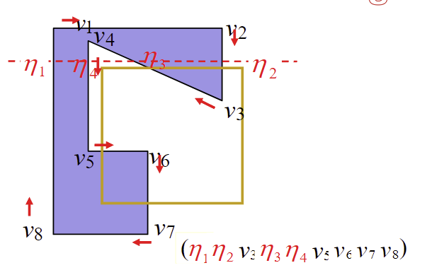
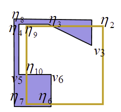
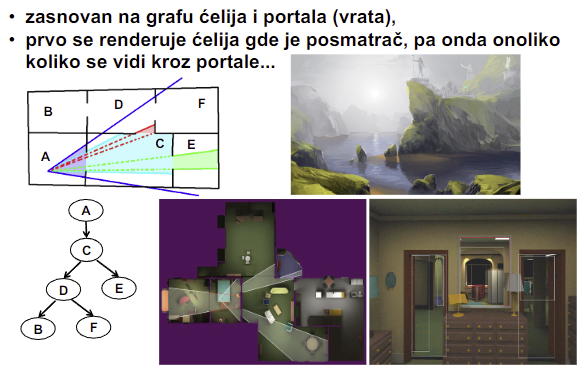

# Predavanje 8
*Clipping se ne radi preko matrica!*

### Cohen-Sutherland
*Ponavljanje*
- Podela kanvasa na 9 podprostora (ako je 2D)
- Svaki prostor se labelira tetradom koje govore gde se on nalazi u odnosu na ose (srednji je 0000)
- Stizu nam koordinate linija
- Svaka linija (2 temena) se labeliraju tetradama
- Prvo radimo AND operaciju nad 2 temena linije. Ako je sve 0000 onda razmatramo, ako ima bar 1 jedinica odbacujemo liniju
- Ako obe tacke imaju 0000 onda se trivijalno prihvataju
- Ako ne, onda linija negde sece nas prostor. Gledamo presecne tacke i biramo 2 tacke koje su blizu te presecne tacke (jer ne mozemo da nadjemo tetradu kad je na osi). Te 2 tacke su npr malo iznad malo ispod ili malo levo malo desno (zavisno od ose) i onda racunamo tetrade. Zatim to provucemo opet kroz algoritam
- Najcesce su linije ili kompletno van prostora (ako je mali prostor) ili kompletno unutar prostora (ako je veliki prostor)
- Ako je 3D, delimo na kuboide pa srednji kuboid prikazujemo (umesto kvadrati, sad su kuboidi i sad su tetrade duze)

### Sutherland-Hodgman
- Kliping poligona (i konveksnih i konkavnih)
- Defacto se oslanja na seckanje linija (prethodni algoritam)
- Isecanje po 4 ose
- Nova temena kad presecemo poligon ce biti presecne tacke (zamisljacemo da je tacno na liniji, ali je to u praksi komplikovano)
- Krenemo po osama (sve 4). Prolazimo kroz temena poligona i gledamo da li pripadaju ili ne pripadaju (u odnosu na osu!!! **jako bitno**). Ako pripadaju zadrzimo, ako ne pripadaju odbacimo. Potom kreiramo nova temena na toj osi gde ona sece poligon. To ponovimo za sve 4 ose. Izlaz svakog prolaska po osi je ulaz u sledeci (ne ponavljamo temena, belezimo samo nova)
- Ovo jako bitno iznad - u odnosu na osu odbacujemo ili prihvatamo. Svaka osa ima "van" i "unutra". Dakle na sledecoj slici zadrzavamo sve sem v1, v2 i v4 jer je sa te strane ose, iako nije u kliping prozoru. Potom cemo u ostalim prolazima modifikovati ovaj niz. Te "eta" presecne tacke su presecne tacke sa osom, dakle neke ce biti odbacene kasnije (jer je ocigledno van posmatranog prostora), a neke ce biti zadrzane

- Napomena - ne sece se bas po linijama da bi objekat ostao povezan (a ne da kreiramo 2 nova objekta). Recimo u softveru za crtanje. To je ono kompleksno iznad sto pise za secenje po linijama. Tako da ne secemo cele linije, nego ostavljamo "tunele" povezanosti

### Culling vs clipping
- Clipping samo odsece, culling izbacuje po nekom uslovu
- Culling svrstava u dve grupe - zadrzava ili odbacuje
- Dosta cullinga se izvrsava tokom clippinga
- View frustum culling - zadrzava sve objekte koji se nalaze u view frustumu (izbacuje one koji nisu). Culling se pusta prvo da smakne sve cele objekte koji ne pripadaju da bi posao clippinga bio laksi (da radi nad manje podataka)
- Sutherland-Hodgman - za 3D prolazi 6 puta (za svaku od ravni) umesto 4

### Uklanjanje skrivenih povrsina
- View frustum culling - sklanjamo sve sto nije u frustumu (van vidnog polja)
- Occlusion culling - sklanjamo sve sto je zaklonjeno drugim objektima
- Backface culling - oni koji su okrenuti ledjima (pripada pozadini objekta)
- Portal culling
    - Portal - otvor na objektu kroz koji mozemo gledati
    - Portal culling - iz objekta izbacuje sve objekte sto se u objektu ne moze videti kroz portal kada gledamo iz kamere
    - Kao view frustum samo na objektu (npr kao neki prozor ili klisura na sceni; kroz prozor sto vidimo u kuci to je portal view, sve napolju je view frustum view)
- Detail culling - ako je nesto previse daleko, ne moramo ga prikazivati u originalnom broju poligona, nego sa manje

### Algoritmi za uklanjanje skrivenih povrsina
- Da uklone povrsine ili delove povrsina koje su zaklonjenje drugim povrsinama
- Object-space techniques
    - Pre rasterizacije temena
    - Geometrija
    - Painter's algorithm, BSP trees, portal culling
- Image-space techniques
    - Posle rasterizacije temena
    - Pixel ili fragment shader
    - Z-buffer, $\alpha$-buffer, ray tracing
- Object-space se obavljaju u procesu geometrije
- Image-space se obavlja u procesu rasterizacije
- Tamo gde painter's algorithm padne, BSP trees mu pomogne. BSP trees nije nista posebno sam po sebi
- Portal culling - zadrzava ili izbacuje na nivou citavog objekta
- Image-space rade na nivou piksela
- Z-buffer sluzi za rasterizaciju prikaza. Dok rasterizuje usput skriva nevidljivo. Opet ima minuse (kao painter's) koje popravlja $\alpha$-buffer. $\alpha$-buffer je tezi za implementaciju i treba mu vise vremena da zavrsi
- Ray tracing skriva tako sto zrak nikad ne dodje do skrivene povrsine :)

##### Painter's algorithm
- Kao slikar - prvo nacrta ono sto je najdalje, pa onda nacrta preko toga ovo novo i tako dalje
- Photoshop layering kao primer kako radi
- Problem - moze se desiti da se objekti preklapaju (delimicno i ispred, a delimicno i iza objekta) i onda ne zna kako da nacrta

##### Binary space partitioning stablo
- Prostor se deli na **ispred/iza** ravni koja sadrzi poligon
- Stablo opise celu scenu deleci prostore na 2 dela. Potom Painter's ide kroz stablo od najdaljeg prema najblizem i iscrtava
- Stablo se kreira tako sto uzmemo jedan objekat i posmatramo sta je ispred njega (npr leva strana stabla) a sta je iza njega (npr desna strana stabla). To mozemo odrediti na osnovu normale naseg objekta
- Savet za odabir prvog objekta - krenuti od nekog centralnog objekta i neka on bude korenski element. Taj centar sluzi da bi stablo bilo izbalansirano
- Ono sto je malo ispred malo iza naseg posmatranog objekta, to delimo na 2 dela. Jedan je ispred jedan iza
- Kada razdvojimo na dva dela, u svakom od delova trazimo centroid pa ponavljamo posmatrajuci elemente samo sa te strane
- Ovo se ponavlja sve dok ne dodjemo do listova
- Kako iscrtavamo - uzmemo korenski element, nadjemo kako kamera gleda u njega - ako gleda u lice onda prvo biramo sve sto je iza njega. Ako gleda u ledja onda prvo biramo sve sto je ispred njega. Kada odaberem podstablo onda gledam u njemu korenski element i ponavljam ovaj proces

##### Portal culling
- Opet se napravi stablo (nije bitno apparently)

- **Ogledalo je takodje portal onoga sto reflektuje!**