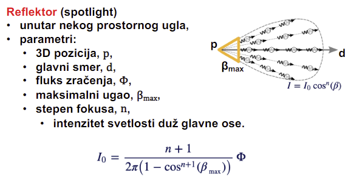

# Predavanje 9 nastavak

## Bojenje i sencenje
- Da bi nesto videli, to nesto mora biti osvetljeno (svetlo mora biti prisutno i naravno kamera)
- Belo svetlo (ono koje nosi sve boje) pada na objekat i taj objekat reflektuje samo fotone svoje boje (npr jabuka samo reflektuje crvenu)
- Mi cemo pricati uglavnom o manje naprednoj grafici koja iako je manje napredna, daje dovoljno dobre rezultate (Phong npr)
- Dva nosaca boja
    - Suptraktivni - kao primer iznad, objekat ce oduzeti sve boje koje njemu ne pripadaju i refletkovace samo onu boju kojom je on obojen; bilo koji objekat na koji pada svetlost je suptraktivni medij
    - Aditivni - nas monitor je aditivni medij; boje se prave tako sto od osnovnih boja pravi onu koja mu treba (tako sto ih sabira)
- Svaki nosac boja ima svoje modele boja
- Suptraktivni model boja - 
    - CMY/CMYK: 
        - RGB zamenimo sa MYC respektivno
        - Sada je bela u koordinatnom pocetku a crna na velikoj dijagonali - to je prirodnije ako zamislimo beli papir
        - Dodavanjem CMY boja na papir tako pravimo nove boje 
        - Svaka od CMY boja ima po dve boje iz RGB modela (C = GB, M = RB, Y = RG)
        - K - moramo dodati BLACK jer u praksi CMY kombo ne daje crnu nego tipa tamno sivu
        - CMYK ne moze da prikaze pune boje
        - Problem isti kao kod RGB - korisnik ne moze jednostavno naci boju u CMYK kocki
- HSV/HSB/HSL
    - Hue, Saturation, Value/Brightness/Lighness:
        - Covek prvo izabere boju, zatim izabere koliko je ona zasicena i koliko je ona osvetljena
        - Ugao kaze koja je boja, visina kaze koliko ima drugih boja u njoj (bele boje u sustini; osvetljenost), a koliko je daleko od ose (koliko te boje ima; zasicenost)
        - Ovim modelom boja korisnik dosta lakse prepoznaje i pronadje boju koja mu treba
        - HSV je cilindar, a HSL model je kao vreteno
        - **Zasto je vretenasto?** - Ako je previse mracno (malo L) onda ne mozemo videti toliko boja, dakle vidimo samo crnu i nijanse sive. Ako je previse svetlo (veliko L), nase oko pocne da se zatvara pa ponovo vidimo manje boja. Zato je vretenasto - pri vrhu i pri dnu moze da prikaze najmanje boja
- LAB/CIELAB
    - LAB
        - Najmladji model, napravili ga francuzi
        - Imamo 3 receptora u oku, ali u mozgu obradjujemo 3 komponente - jedna za osvetljenost, a druge dve su a i b - razlika plave i zute, razlika crvene i zelene
        - L - lightness, A i B - razlike od po 2 boje
        - Razlika se gleda jer smo u prirodi navikli da te dve boje se retko pojavljuju zajedno
        - LAB jedini pokriva sve boje koje mi mozemo videti
        
- Aditivni model boja - 
    - RGB - Problem: korisnik ne moze jednostavno naci boju u RGB kocki
    - RGBA - alpha kanal - koliko je boja providna

### Dithering
- Mozemo ponovo da prevarimo korisnika igrajuci na loptu da nemamo mikroskope nego imamo oci :D
- Mozemo smanjiti broj boja na slici tako da bude maltene neprimetno
- Mozemo da usrednjavamo susedne boje
- Ne smemo uvek - npr ne smemo u medicini
- WEB-safe boje - 216 boja; Mogu dosta dobro u dosta slucajeva prikazati slike koje imaju mnogo vise boja
- Browseri mogu biti WEB-safe kompatibilni - svi browseri treba sve boje da prikazuju na isti nacin

### Svetlost
- Kada svetlost pogodi neku povrsinu:

- Desavaju se i sva 4 u isto vreme
- Mi cemo raditi sa lokalnim svetlom, dok prava grafika radi sa globalnim svetlom (i direktna svetlost, i indirektna svetlost, i bouncing svetlosti...; realizam)

##### Tipovi izvora svetlosti
- Tackasti
    - Ravnomerno svetlo
    - Intenzitet:
    
    - 3D pozicija, tacka p0
    - Moze se javiti polusenka - sto je precnik tackastog izvora veci, polusenka je veca
    - Slabljenje:
    
    - Vidljivost opada sa kvadratom - losa strana
- Reflektorski
    - Tackast izvor usmeren u jedan pravac sa jednim uglom gledanja
    - Sto ide dalje od ose, intenzitet mu pada
    
    - Dobar je da istakne deo prostora - spotlight
- Direkcioni
    - Udaljeno osvetljenje koje pada paralelno
    - Daje jako lep prikaz o svemu na sta ono pada (a pada na vecu povrsinu)
    
- Ambientalni
    - Iz svih smerova, dolazi iz izvora koji ima jako veliku energiju
    - Intenzitet:
    
    - Ako primenimo samo ambijentalno svetlo - vidimo objekat, ali nemamo pojma koje je boje, od koje teksture/materijala je napravljen, ne vidimo promene na povrsini objekta
    - Svetlo napada sa svih strana a nije dovoljno jako reflektovano

## Jednacina renderovanja

- BRDF - funkcija refleksije; veoma kompleksna
- Phong je dosta pojednostavio BRDF