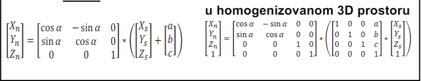
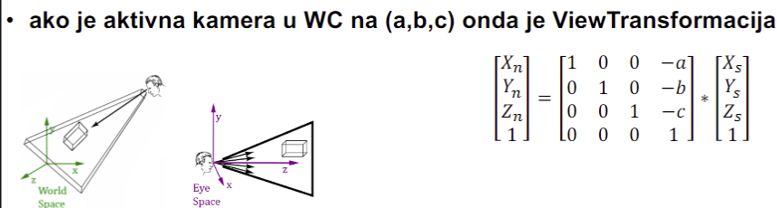
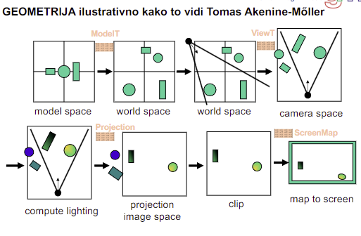

# Predavanje 1 - Uvod

### Osnovni pojmovi i procesi

3D esencijalni i perceptivni:
- Tacka - osnovna, ne mozemo mnogo da zakljucimo
- Linija 
    - povezuje tacke i daje smisao
    - vise informacija o slici ali opet nedovoljno (ne mozemo zakljuciti da li je puna kocka ili nije, da li je probusena ili cela...)
- Trouglovi (gradivan element; najmanja povrsina)
    - vise informacija o telu
    - mreza trouglova pokazuje da li je kocka puna/prazna/probusena...
    - 3 vertex, 3 edges
    - ne znamo materijal
    - mesh model - skup zatvorenih planarnih povrsina gde je svaka povrsina predstavljena kao skup temena gde svaka 2 temena povezuje ivica, svaka ivica je uvek deljena izmedju 2 povrsine, a svako teme je deljeno izmedju barem 3 povrsine
- Transformacije
    - da dobijemo osecaj da je "zivo"
- 3D/2D projekcija/skrivanje
    - ekrani su 2D, a mi pokusavamo da prikazemo 3D (ne vide se sve povrsine)
    - osecaj da korisnik umesto da gleda u ekran ima osecaj da stoji na sceni i posmatra nasu grafiku
    - projekcija 3D sveta na 2D svet
    - najtezi zadatak (sakrivanje nevidljivih povrsina)
    - ovo ce nestati kad ekrani postanu 3D (lol)
- Bojenje
    - svaki piksel obojimo
    - medjutim izgubimo percepciju 3D modela (vidimo mrlju)
    - fale nam senke!
- Sencenje
    - svetle/tamne boje, zavisnosti od svetla i ugla iz kog posmatramo
- Teksture
    - slika materijala
- Spajanje (blending, merging)
- Kliping (secenje)
    - korisnik moze da vidi samo onaj deo koliko mu je ekran veliki (isecemo ostalo)

### Arhitektura graficke aplikacije

Korisnik preko ulaznih uredjaja komunicira sa aplikacijom. 
CPU racunara radi logiku. Racuna polozaje objekata
Graficka rezultate svog rada belezi u **frame buffer**. Ono iz frame buffera se prikazuje na ekranu
Ako prebacimo cpu posao na gpu onda ce biti brze, lepse...

Na sceni moraju biti objekti. Aplikacija daje grafici:
-   sve objekte koji stoje na sceni i barem jednu kameru. Samo iz aktivne kamere se sve obradjuje i ide na prikaz. Aktivna kamera uzima **kopiju** scene i prikazuje, scena ostaje nedirana
-   barem jedan izvor svetla (ambijentalno svetlo - sveprisutno)

### Renderovanje

Na izlazu treba da prikaze pixmaps (mapa onoga sto se vidi iz date kamere)
Koraci:

- 3D graficki model
    - 3D skeniranje objekata u graficki model. To skenirano mogu menjati
    - Interaktivno modelovanje - od virtuelnih elemenata pravimo nove (skupovnim operacijama)
    - Biblioteke modela - kupimo/skinemo neki model umesto da pravimo
    - Displacement mapping - promena povrsina (npr svaku trecu povrsinu izvlacimo napolje i telo postane bodljikavo)
    - Material properties - kombinacija parametra da docaramo da je to nesto od materijala koji smo namestili
- 3D animacije (pokret)
    - Dizajniranje pokreta - nelinearno (i po brzini i po dodiru...)
    - Izracunavanje pokreta - isto kao dizajniranje, samo matematikom i fizikom umesto "osecajem" (dizajnerski)
    - Motion capture - hvatamo pokret i prenosimo na animaciju (za komplikovane animacije ili za prirodne animacije)
    - Dynamic deformation - proracunima menjamo povrsinu oslanjajuci se na neku karakteristiku objekta
- Informacije o teksturi 
    - Skeniranje teksture - skeniramo teksturu
    - Proceduralno sracunavanje - proceduralno generisanje tekstura
    - Oslikana tekstura - naslikamo pa iskoristimo kao teksturu
- Informacije o povrsini (fizicke informacije)
    - Transparentnost - nikad nije homogeno transparentno (nece biti skroz providno); refrakcija - drugacija prelamanja svetlosti
    - Reflektivnost - odbijanje (kod uglacanih povrsina); spekularna refleksija - "beli krug"
    - Subsurface scattering - ispod povrsine se svetlost razlaze pa se reflektuje prema spolja
- Informacije o osvetljenju
    - Tip izvora svetla - svaki tip svetla drugacije osvetljava
    - Pozicija izvora svetla - sto je blize to je svetlije
    - Jacina izvora svetla
    - Boja izvora svetla

Sve zajedno se cuva (na disku) i/ili prikazuje (ode u frame buffer) u vidu rasterske slike

Renderovanje je generisanje rasterske slike na osnovu 2D/3D modela iz aplikacije smestenih na scenu

Aplikacija -> Geometrija -> Rasterizacija -> Frame buffer

Renderovanje je organizovano kao pipeline **geometrije** (per vertex) i **rasterizacije** (per pixel)

Svaki proces u pipeline-u resava jedan deo posla. Pipeline se moze ubrzati paralelizmom

### Osnovni graficki pipeline

#### GEOMETRIJA

##### Model & View Transform
- Transliranje, skaliranje, rotiranje
- Svaki model ima svoje atribute i koordinate
- Object/Model space - ovde kreiramo model sa atributima i koordinatama
- **Model transform** - postavlja model na zeljenu poziciju iz model space-a u world (scenu)

- **View transform** - mapira temena iz world (scene) u koordinatni sistem kamere (camera space)

- Camera space - prostor na koji korisnik gleda iz neke tacke scene "kroz kameru"
##### Vertex shading
- Radi sa vertexima; Moze sve sem da kreira ili unistava temena, ali moze podatke koji su pridruzeni temenu
- Racuna srednju normalu temena (usrednjava normale)
- Moze racunati i boju u temenu (na osnovu normale; srednju boju)
##### Projection
- Paralelna ili perspektivna projekcija matricom projekcije; 2.5D svet
- Cesto paralelizovana sa narednom fazon (klipingom)
##### Clipping
- Isecanje na ono sto kamera vidi (na ViewPort kamere)
- Destruktivan po temenima (izbacuje ona koja se ne vide, ali potencijalno uvodi nova)
- Klipuje se na "kvadrat" koji se vidi (unit cube) pa se posle u screen mappingu dalje procesira
- Ovo se ne radi matricama, nego algoritmom
##### Screen Mapping
- Iz kvadrata klipinga razvlaci na odnos sirine i visine prozora; skaliranje + transliranje

#### Vizuelizacija

#### RASTERIZACIJA
##### Triangle Setup
- Izbaci one trouglove koji su ledjima okrenuti (**backface culling**)
##### Triangle Traversal
- Prolazi kroz trougao i formira **fragmente** - fragmenti su povrsine iste boje; pikseli u nastajanju
##### Pixel Shading
- Pronalazi u svakom fragmentu koliko ima piksela, koja je boja u zavisnosti od toga kakvo je osvetljenje i kako da im nalepi teksturu
- Osnovne operacije su texturing i per pixel lighting
##### Merging
- Blending i lepljenje bafera?

Ovo iznad pomeuto je fiksni graficki pipeline

### Programabilni graficki pipeline

#### Shaderi

##### Vertex
- Transformacija temena i normala, bojenje temena i rukovanje tekselima
- Ostali poslovi fiksne funkcije (kliping, homogenizacija, viewport mapping, backface culling...) - ovaj deo se radi po automatizmu
- Radi se i prvo po automatizmu ako treba, ali mozemo menjati i uticati na bilo sta sto zelimo
##### Tesalacioni
- Opcioni
- Tesalacija konkavnih poligona na konveksne
- Konveksni poligoni su lepo zaobljeni i mogu u bilo kom polozaju da se prikazu na jedinstven nacin bez ikakvih gresaka, dok kod konkavnih linije mogu vise puta da presecaju poligon sto otezava prikaz
- LOD - level of detail; proracunavanje koliko se stvari vidi
##### Geometrijski
- Opcioni
- Naprednije upravljanje topologijama: linije (strips, loops), trouglovi (strips, fan), quads (strips)
- Omogucava promene nad vecim povrsinama
##### Fragment/piksel
- Racuna svetlo i boju, teksturise, fog (magla)
- Ostali poslovi fiksne funkcije (blending, stencil test, depth test, scissor test...)
- Moguca automatizacija isto kao kod vertex shadera 

### OpenGL - konacni automat

- Stanja koja imaju podesena sve default parametre za laksi rad
- Omogucava da mozemo pozivati funkcije samo sa argumentima koji su neophodni za nju (samo ono sto nam treba, ostalo je vec podeseno)
- Glavni program i shaderi
- Svaki shader mora imati main
- Moguce klase promenljivih:
    - uniform - nema promena, read-only
    - in - ulaz u shader, read-only
    - out - izlaz (iz vertex u fragment, odnosno iz fragmenta u frame buffer)
##### VBO - vertex buffer objects
- Prenos podataka o verteksima u blokovima direktno u video memoriju (organizovani onako kako mi zelimo)
##### VAO - vertex array objects
- Niz do maksimalno 16 atributa o VBO
- Opisuje stanje mesh mreze objekta opisanih u referisanim VBO

*U nastavku sledi manje bitno*
##### Opsti template OpenGL programa
- #include datoteka
- Deklaracije podataka
- main()
    - GLFW za prozor i hendlovanje dogadjaja
    - GLEW biblioteka
    - Buffer objekti i punjenje podacima
    - Shader objekti pomocu CreateShader
    - Kreiranje program objekata
- CompileShader()
    - Otvara i prevodi shader kodne datoteke
- CreateShader()
    - Formira objekte programa i shadera, poziva kompajliranje pa ih linkuje u jedan objekat
- Ostale funkcije...