# Predavanje 10

### Jednacina renderovanja

- $L_o(v)$ - reflektovana svetlost na osnovu cega mozemo detektovati boju, koliko je oslabljena svetlost...
- $x$ - mala povrsinica koju zelimo da obojimo
- $n$ - normala na x
- $L_e(v)$ - koliko materijal sam od sebe emituje svetlost (isijavanje)
- $f_r(v, l)$ - daje odnos svetlosne energije koja je izasla i energije koja je usla
- $L_i(l)$ - sve upadne svetlosti na toj povrsinici (na primeru imamo samo jednu)
- $cos(\theta)d\omega$ - refleksija pod istim uglom kojim je i dotaklo povrsinu (Lambertova refleksija)

### BRDF
- BRDF - Bidirectional Reflectance Distribution Function
- Odnos kolicine svetlosti koja je reflektovana i svetlosti koja je usla unutra (ne samo usla unutra, nego usla, reflektovala se, bouncovala...)
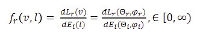
- Ova funkcija je jako kompleksna (ima puno parametara)
- Iz svih uglova se racuna brd funkcija pa u zavisnosti od materijala dobijamo odredjene vrednosti (?)
- Raspianje oko prave Lambertove refleksije nam pomaze da docaramo da li je objekat skroz uglacan, manje uglacan ili uopste ne reflektuje nista
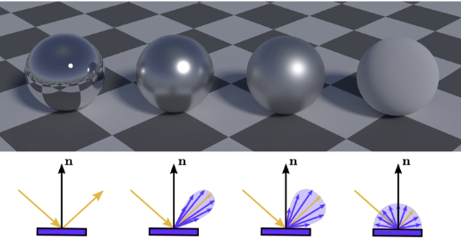
- Osobine BRDF:
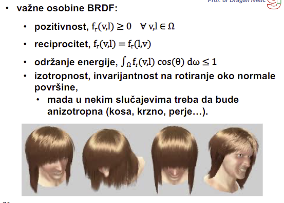
- Izotropnost - svuda daje isti odsjaj (pravi krug); ali u nekim slucajevima bi valjalo da bude anizotropna (slika iznad)

## Phongova svetlosna jednacina
- Pojednostavio jednacinu renderovanja
- Njegova BRDF - sabiranje difuzne i spekularne komponente; u sustini sabere sve izvore svetlosti - suma umesto integrala
- Difuzna - koliko se svetlo rasprsava na sve strane
- Spekularna - "bela tackica"
- Samo lokalna iluminacija - $\int$ presao u $\sum$; lokalna je ona koja dolazi iz direktne svetlosti (ako imamo beli i plavi objekat, necemo imati plavu refleskiju na beli objekat)
- Odsustvo indirektnog osvetljenja nadomestio refleksijom ambijentalnog svetla (za odsjaj - isijavanje)
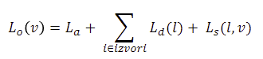

#### Ambijentalna komponenta
- Jednacina sa ambijentalnom komponentom $L_a$:
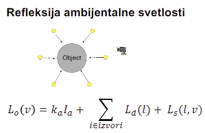
- $k_a$ - ambijentalna refleksija materijala tog objekta. To se pomnozi sa intenzitetom ambijentalne svetlosti koja pada na taj objekat odnosno $I_a$
- Kada uzmemo samo ambijentalno svetlo, nema dovoljno reflektovane energije za prikaz detalja:
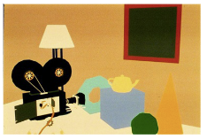

#### Difuziona komponenta
- Difuzna refleksija direktne svetlosti - ponasa se tacno po lambertovom zakonu
- Jednacina sa difuzionom komponentom $L_d$:
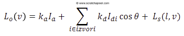
- $k_d$ - difuzna refleksija za taj materijal (koeficijent). To se pomnozi sa intenzitetom difuzione komponente $I_d$
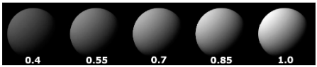
- Razlika izmedju ambijentalne i difuzione i kombinacije obe komponente:
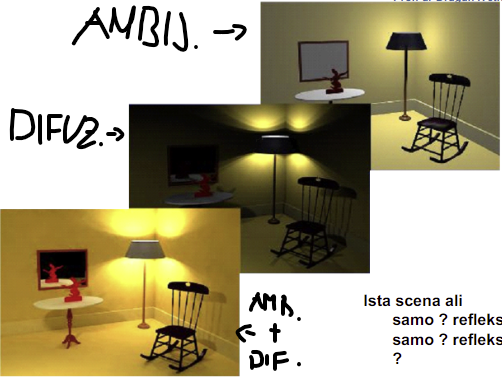

#### Spekularna komponenta
- Ako se ugao pod kojim korisnik gleda poklapa sa uglom pod kojim se svetlost reflektuje, tada se vidi najjaci odsjaj. Sto ugao raste, odsjaj bude sve manji i manji
- Jednacina sa spekularnom komponentom $L_s$:
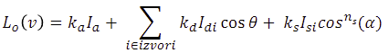
- $k_s$ - koeficijent materijala objekta za spekularnu refleksiju. To se pomnozi sa intenzitetom spekularne komponente $I_s$
- $\alpha$ - ugao refleksije i view vektora ($r$ i $v$)
- $n_s$ - shininess - koeficijent sjajnosti. Primer $n_s$ i $k_s$ ispod:
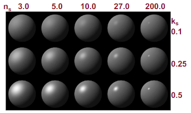

Mogu za svaku tacku da racunam fongovu jednacinu i da je obojim - ali ce to da traje. Umesto tacka po tacka, uzecemo povrsinu i po njoj cemo aproksimirati iluminacionu formulu. Taj proces aproksimacije se zove **sencenje (shading)** (da na brzinu "zamazemo"). Tako stvaramo iluziju da je objekat s jedne strane svetliji a s jedne strane tamniji

Do sada nismo vodili brigu o boji, vec samo o svetlosti. Ako zelimo i boju da uvedemo u pricu, treba nam koeficijent za svaku komponentu za svaku boju, dakle 9 koeficijenata u prethodnoj jednacini - racunamo jednacinu po jednom za svaku boju, to je 3 racuna

Postoje 2 skole - jedna kaze da ambijentalna ne donosi nikakve informacije o boji pa ne bi trebalo da dajemo koeficijente za nju, dok druga skola kaze da moze ali oni nisu uspeli da izvuku koeficijente za ambijentalnu pa koriste koeficijente difuzne komponente.

#### Slabljenje reflektovane svetlosti
- Slabljenje:
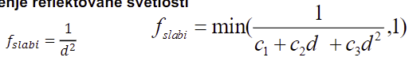
- Ako pada sa kvadratom udaljenosti, mnogo se brzo menja za male distance od kamere. Zato se koristi druga formula
- Jos 3 koeficijenta - sada imamo 12 koeficijenata
- Na koji tip refleksije treba primeniti slabljenje i zasto? - Na difuznu i spekularnu refleksiju jer je za ambijentalnu refleksiju zanemarljivo slabljenje
- Fongova jednacina sada izgleda ovako:
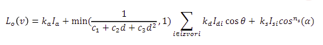
- Dosta je bolje izraziti kosinuse i sinuse kao skalarne proizvode
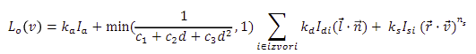
- Sve vrednosti su poznate sem reflektovanog vekotra $r$. Da ne bi racunali reflektovani vektor, koristi se Blin-Fong BRDF koja uzima srednju vrednost izmedju normale i ugla kako kamera gleda
- Blin-fong BRDF:
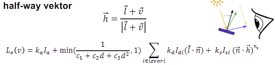

## Sencenje
- Ako cemo za svaku tacku racunati fonga onda nam treba dosta vremena. Umesto toga, zamazacemo svaku povrsinu na nacin da racunanje bude lakse, ali da zadrzimo "realnost" koju prikazujemo korisniku
- U sustini, gledamo koliko susednih tacaka da ofarbamo istom bojom kako bi ustedeli na racunanju
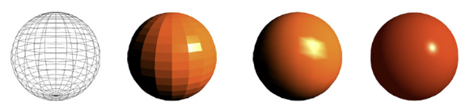
- Prvo je wireframe prikaz
- Drugo je konstantno sencenje - per vertex coloring. Svaka povrsina je jedna boja
- Trece je Gouraud sencenje - per vertex coloring. Usrednjimo normale u tom temenu i na tu usrednjenju normalu nadjemo boju pa je razmazujemo duz poligona. Problem: spekularna refleksija izgleda *yikes*
- Cetvrto je Phong sencenje - per fragment coloring. U fragment shaderu se sad radi bojenje, a vertex shader samo usrednji normale
- Napomena: **Sve 4 slike koriste fongovu iluminacionu formulu!**. Dakle Phongovo sencenje $\ne$ Phongova formula

#### Konstantno sencenje
- Nase culo vida ne salje celu sliku mozgu, nego samo razlike u odnosu na prethodnu sliku (gleda da salje sto manje informacija)
- To stvara problem percepcije, gde ce nase oko kod razlika u intenzitetima perceptirati jos vece razlike nego sto su zapravo
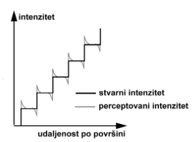

#### Gouraud secenje
- Ne posmatramo normale za svako teme, nego usrednjimo normale za svako teme
- Za tu normalu onda poziva fongovu formulu (po jednom racuna formulu za svako teme trougla)
- Zatim te vrednosti boje sa temena interpolira kroz poligon
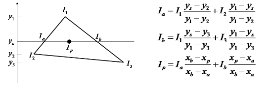
- Problem: spekularna refleksija - intenzitet spekularne refleksije zavisi od normale. Gouraud usrednji normale pa nema pojma o normali unutar poligona

#### Phongovo sencenje
- Ponovo usrednjava normale (da bi razlika u boji izmedju susednih povrsina bila blaga)
- Medjutim, Phong sada interpolira i usrednjene normale duz poligona
- Fragment $\ne$ piksel. Fragment je skup piksela (najcesce)
- **Moguce pitanje** Ako je LOD nekog objekta 100 i taj objekat sencimo flat sencenjem (konstantno sencenje), koliko ce poziva iluminacione formule? - 100. A ako su sve trouglovi? - 100 * 3 poziva za Gouraud. 100 * br_fragmenata za Phongovo a to je > 100 * 3
- Ovu preciznost placamo brzinom (sporiji je logicno)

## Rasterizacija
- Konvertovanje geometrijskog opisa u boje piksela u frame bufferu
- Operacije:
    - Crtanje linija na ekranu, simetrija
    - Crtanje i bojenje poligona (trouglova)
    - Manipulisanje poljima piksela (pixmaps): kopiranje, skaliranje, rotiranje...
    - Aliasing i antialiasing
- Crtanje poligona:
    - As is - kakav god da je oblik, nacrtamo ga onakav kakav jeste. Dosta izazova i specijalnih uslova
    - Podeliti na trouglove (triangulacija). Crtam samo trouglove

#### Polygon scan conversion
- Ljudi su hteli da osmisle algoritme da prate hardver (stari hardver, isli liniju po liniju i palili piksele - scan linija po scan linija)
- Ovaj algoritam se oslanja na to da se iscrtava po tim scan linijama
- Uzmemo poligon (skup temena) i ide sa svakom scan linijom trazi presecne tacke sa ivicama poligona (presek sa linijama)
- Ako neka scan linija nema nijednu presecnu tacku ni sa jednom linijom poligona to znaci da se taj poligon ne nalazi na toj scan liniji
- Presecne tacke se sortiraju rasuce po X da bi bio siguran da su presecne tacke redom, bez obzira na to kako je zadat poligon
- Za svaku scan liniju krene se od pocetka scan linije i ne bojimo piksel sve dok se ne kaze drugacije
- Svaka presecna tacka menja tu vrednost iz ne bojim u bojim i obrnuto (znaci idemo piksel po piksel i kad nadjemo presecnu tacku, toggluje se flag "bojim" na true pa se boji svaki sledeci piksel, pa kad naidje opet toggluje flag "bojim" na false)
- Postoji dosta problema (dosta ifova). Najznacajniji problem:
    - Sta raditi ako je presecna tacka sa nekom linijom poligona zapravo njeno teme? - Ako je to minimalno teme za ove dve linije, onda je ignorisemo (ako je donja tacka)
- Ostali problemi:
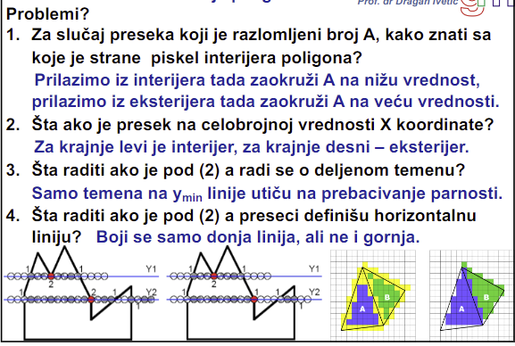