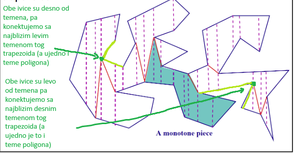
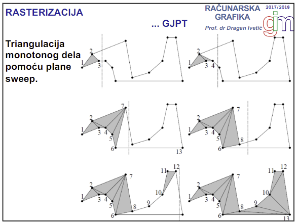

# Predavanje 11

## Triangulacija poligona
- Deljenje poligona na skup nepreklapajucih trouglova upotrebom dijagonala
- Broj trouglova treba da bude najmanji moguci, da se oni ne preklapaju i da korisnik ne vidi trouglove nego da vidi poligon
- Radi samo sa jednostavnim poligonima
- Svaki n-ugaoni poligon se sastoji od tacno n-2 trougla
- Resenja:
    - Naivno - probati $n^2$ mogucnosti za svaku dijagonalu $O(n)$ i onda rekurzivno ponoviti jos n-1 put -> $O(n^4)$
    - Manje naivan - ear clipping poligona ($O(n)$) i rekruzivno ponoviti jos n-2 puta -> $O(n^2)$
    - GJPT-78 - dekompozicija monotonih poligona koji se zavrsava u $O(nlog(n))$
    - Bernard Chazelle $O(n)$ osmisljen 1991. godine i nema implementacije zbog prekompleksnosti (ima, ali tad nije imao :D)

### Ear clipping
- Osnova je glavno teme (principal vertex)
- Principal vertex $p_i$ se bira tako da susedna temena mogu biti povezana pravom dijagonalom i ako cela dijagonala pripada unutrasnjosti poligona (ako se moze izmedju susednih temena povuci linija koja ne sece nijednu stranicu poligona)
- Nakon isecanja tog trougla, ponovimo sve opet
- Ako konveksno teme $p_i$ nije glavno, pronalazi se reflektivno teme koje formira dijagonalu sa $p_i$ i stvara dva nova trougla

### GJPT-78
- Recept:
1. Podeli poligon na trapezoide
2. Konvertuj trapezoide u monotone delove
3. Svaki monotoni deo podeli na trouglove
- Sweeping - pomeranje; npr po x osi (pomeramo y osu po x osi). Moze i suprotno, moze i pod uglom...
- Monotoni lanac - polyline (skup linija) kojim sweeping po x osi sece taj lanac samo u jednoj tacki
- Monotoni delovi su spojeni sa 2 monotona lanca
- Podela na trapezoide povlacenjem linijama po y osi za svaki vertex: 

- Monotona podela - za svako reflektivno teme split ili merge tipa napraviti dijagonalu prema levom (ako je split tip) odnosno desnom (ako je merge tip) temenu
- Split tip - teme iz kog se dele dve ivice
- Merge tip - teme u koje se spajaju 2 ivice

To iznad kako je profesor objasnio je malo nesrecno. Probacu ja da objasnim. Teme poligona je deo uvek 2 ivice. Ako je jedna ivica sa leve strane temena, a druga ivica sa desne strane temena onda je to regularno teme. Ako su mu obe ivice sa desne strane ili obe ivice sa leve strane, onda je to reflektivno teme. Split teme je ono teme kod kog su obe ivice sa njegove desne strane. Merge teme je ono teme kod kog su obe ivice sa njegove leve strane. Iz split temena se povlaci dijagonala ka najblizem levom temenu tog trapezoida (ali ujedno **mora** biti i teme poligona). Iz merge temena se povlaci dijagonala ka najblizem desnom temenu tog trapezoida (ali ujedno **mora** biti i teme poligona). Slika ispod:

Verovatno se zove reflektivno jer menja monotoniju u toj tacki, ali nmp. Nastavljamo dalje regularno :D
- Zatim se nad monotonim delovima vrsi triangulacija pomocu plane sweep algoritma:

- 4, 5, 6 preskace jer nije dobar trougao
- Jasno je sa slike kako radi

### Crtanje trouglova
- Rekurzivni algoritmi za rasterizaciju:
    - Recursive subdivison into micropolygons - svakoj stranici nadjem sredine i spojim sredine. Zatim ponovim opet isto za sve nove poligone. Prestajem da delim kada je novi poligon koji dobijem manji od piksela
    - Recursive subdivison of screen (Warnock) - slicno kao spatial enumeration; deli ekran u delove. Ako nema trougla u tim delovima, odbacuju se delovi, a ako ima ponovim deljenje opet. Sporije konvergira

##### Edge walking algoritam
- Jako se oslanja na trougao (trougao uvek ima jedno gornje i jedno donje teme, a ovo u sredini moze biti levo ili desno)
- Ivice crtamo vertikalno, a ispunjavamo piksele izmedju njih po sken liniji horizontalno red po red
- Treba utvrditi da li se srednje teme nalazi levo ili desno ili nema breakpoint (ako se stranica trougla nalazi na sken liniji)
- Moze biti veoma brz, ali ima puno specijalnih slucajeva
- **Jaggies** - stepenice prilikom crtanja. Kako ih resiti? ili povecamo rezoluciju, ili koristimo **aliasing** - zamazivanje da se prikaze bolja linija (manje uocljive stepenice)
- Aliasing - obojimo samo one piksele na koje idealna linija pada. Sve piksele okolo bojimo onoliko crno (jer je nasa linija bila crna) koliko je procenata on pokriven sa tom idealnom pravom

##### Edge equation algoritam
- Treci algoritam koji deli prostor (deli na polu ravni)
- Trougao se predstavlja kao 3 prave provucene kroz 3 temena i prikazuju se jednacinama prave
- Svaka prava deli prostor na 2 polu ravni
- Kako znamo da li su pikseli unutar trougla ili van trougla (sa koje strane poluravni se nalaze)? - Ako za dati piksel koji ispitujem kada uvrstim u sve 3 jednacine prave dobijem pozitivnu vrednost - onda je on izmedju njih (u trouglu). Ako barem jedna jednacina kaze da je vrednost piksela < 0, onda odbacujem
- Da ne bismo proveravali ceo prostor ekrana piksel po piksel da li se nalazi u trouglu, mozemo posmatrati samo opisani pravougaonik oko trougla (sortiramo koordinate temena pa nadjemo)

### Pixmaps
- Matrica piksela okarakterisana svojom rezolucijom (brojem redova i kolona) i svojom dubinom (depth). Dubina je broj bitova za svaki piksel odnosno **color depth**. Dubina nije broj boja!
- Kopiranje pixmap u frejm bafer je **renderovanje** (tada se iscrtava)
- Bitmapa - pixmap sa 1 bitom za depth
- Grayscale - pixmap sa 8 bita za depth
- RGB i RGBA su 24 i 32 bita respektivno
- RGBA (32 bita) je takozvani truecolor
- Operacije nad pixmapama:
    - Skaliranje
    - Rotiranje (transponovanje matrice) za po 90 stepeni
    - Algebarsko kombinovanje - dve slike A i B mozemo "sabirati", "mnoziti", "oduzimati"... bilo koja algebarska operacija. Slike moraju biti istih rezolucija
    - Alpha channel i image blending
    - Kompozicija - definisano nekih posebnih 12 operatora, rekao je da je nebitno :D

#### Skaliranje
- Smanjivanje (destrukcija) i uvecavanje
- Problem je interpolirati piksele koji ne postoje (kod uvecavanja)

##### Bez interpolacije: 
- Nearest neighbour
- Imamo ponavljanje piksela sto je brzo, ali dobijamo jaggies (tj grain, sum)

##### Sa interpolacijom:
- Linearna interpolacija 
    - Slika ne moze da se uvelicava linearnom interpolacijom jer ne zavisi samo od jedne dimenzije pa ovo bas i nema smisla
- Bilinearna interpolacija
    
    - Nece biti matematike na testu, al "moze" na usmenom da dodje pa evo
    - Problem - na vecoj slici ce se pojaviti te uvelicane cetvorke - ta potencijalno velika razlika (najvise se primeti tamo gde svetlo lepo menja vrednosti piksela)
- Bikubna interpolacija
    - Sada ne uticu samo najbliza 4 piksela na novi piksel, nego uticu (doduse manje) i ortogonalna grupa suseda iz daljeg originala i dijagonalna grupa suseda iz daljeg originala
    

#### Algebarsko kombinovanje
- Za svaki i, j piksel iz matrice A odradimo algebarsku operaciju sa i, j pikselom iz matrice B i to postane i, j piksel u novoj matrici C
- Tipa $Ci,j = Ai,j + Bi,j$
- Cross-disolve - Jedna slika se pretvara u drugu

#### Alpha channel & Image blending
- Mesanje slika (blending)
    - Prikaz delimicno transparentne slike preko druge slike
    - Standardnoj RGB se dodaje Alpha channel vrednost
    - Transparentnost piksela zavisi od alpha vrednosti
    - Tamo gde je alpha vrednost maksimalna, tu je skroz transparentno. Tamo gde je alpha vrednost minimalna, tu nema transparentnosti