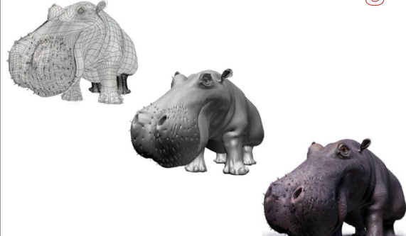

# Predavanje 12

## Teksture

- Prva slika je mesh model
- Druga slika je sa sencenjem
- Treca slika je sa nalepljenom teksturom
- 2D teksturisanje - Lepim 2D sliku na 3D objekat tako da ta slika uvek lepo legne na objekat (nece se zguzvati ni pocepati)
- 3D teksturisanje - Napravimo materijal od kog je napravljen objekat, pa od njega sklanjamo sve sto nije taj objekat da nam ostane isteksturisan objekat. Mora da se zna boja svakog voksela u prostoru tog objekta

#### Tehnike 2D teksturisanja
- Slikanje 2D objekta na povrsinu 3D objekta (Mudbox)
- Environmental mapping - da se slika na okruzenje
- Displacement & bump mapping - Displacement menja geometriju objekta (npr izvlacimo piksel prema lopte i dobijemo bodljikavu loptu) dok bump ne menja geometriju, nego menja normale (iskrivi ih)
- Proceduralno mapiranje teksture - program proceduralno cita teksele iz teksture i lepi na objekte
- **Texel** - element teksture (kao sto je piksel element slike)
- Kad smo kod ovoga, voxel je 3D piksel (volumetrijski piksel), a piksel moze biti logicki ili fizicki - fizicki je na ekranu a logicki je recimo u fajlu

##### Environmental mapping
- Snima se neki realni objekat sa vise strana pa se nalepi na objekat kao tekstura

##### Displacement & bump mapping
- Displacement mapping - Zapravo menja geometriju - npr izvlaci svaki treci vertex i kao takve ih salje dalje (ili npr planeta zemlja, pa zelimo malo da izvucemo visoke povrsine)
- Bump mapping - menja normale i kao takve ih salje na prikaz (ne menja geometriju objekta)

##### Proceduralno mapiranje teksture
- Programsko mapiranje teksture na projektovani objekat na ekranu
- Tekstura je definisana ili algoritamski (uobicjaneo za 3D) ili pixmapom
- Neophodna su nam temena objekta, tekstura koja se lepi preko i pravila lepljenja (za taj i taj vertex odgovara taj i taj texel). Ostale tacke unutar trougla se interpoliraju na osnovu teksela
- Problem - jedan vertex moze ici na deo, jedan ili vise teksela
- Problem povezanosti tekstura (kontinualnost teksture) - kada dva susedna trougla drugacije teksturisem, moze se primetiti da nisu "povezani"
- Resenja problema povezanosti:

###### Projekciono teksturisanje
- Projektujem na objekat, vezem teksele za piksele i onda mapiram fragmente izmedju

###### Kroz posredovanje
- Najcesce koriscen
- Teksturu stavim na posrednika, sa posrednika spustam teksturu na objekat
- Kocka, cilindar, sfera - posrednici
- Biramo onog posrednika koji je najblizi obliku naseg objekta
- Kako sada sa posrednika na 3D objekat?
- Jedan nacin je da sa svakog teksela sa teksture krenemo normalno ka objektu i gde ga dodirnemo tu spustimo teksturu
- Drugi nacin je krenuti sa objekta normalno na teksturu i koga dotaknemo na teksturi to spustimo na objekat
- Treci nacin je krenuti iz centroida objekta krenuti radijalno ka teksturi
- Problem - aliasingom mozemo da promenimo pattern teksture
- Problem - perspektiva; tekstura sa objekta moze izgledati cudno zbog perspektive pod kojom smo lepili
- Prilikom preslikavanja teksture moramo paziti na:
    - Mapiranje vise teksela na piksel
    - Interpolacija ka x, y
- Odnosno problemi kad je tekstura veca ili manja od objekta na koji lepimo
- Nearest neighbour i bilinear mapping mozemo koristiti
- MIP mapping - imamo vise tekstura razlicitih velicina da bi lakse bilo da nadjemo onu koja odgovara velicini koja nam treba (manje vremena nam treba da nalepimo teksturu, ali nam treba vise prostora da cuvamo vise tekstura)

#### Tehnike 3D teksturisanja
- 3D tekstura ili solid tekstura
- Proceduralno dodeljivanje vrednosti tacki u prostoru
- Dobijamo utisak da je objekat isklesan od punog materijala
- Najvise se koriste dve funkcije - **noise** i **turbulence**
- Sa te 2 funkcije se mogu napraviti 3D teksture za dosta materijala

##### Noise
- Kontinualna funkcija koja varira u 3D prostoru uniformnom frekvencijom
- Stvara se sum kao npr na onom starom televizoru kad nema kanala :D
- Generise se random vrednost za svaku tacku na teksturi pa se tako dobija noise efekat
- Problem - previse je zrnasta, pa izgleda neprirodno materijal

##### Turbulence
- Uposljava nekoliko noise funkcija odjednom (resava problem granularnosti od pre)

- Primer turbulence funkcije

### Frame buffer
- OpenGL ima svoj logicki frejm bafer koji je drugaciji od onog fizickog, pravog frejm bafera da bi mu bilo lakse da rukuje podacima (o tom logickom sada pricamo, fizicki samo crta na ekran)
- On se sastoji od:
    - Color segment bafer - cuva boju
    - Depth segment bafer - cuva Z vrednost
    - Stencil segment bafer - cuva sablon (ovaj piksel je skroz providan, ovaj je skroz neprovidan, ovaj je nesto izmedju...)
    - Accumulation segment bafer - cuva akumulirane podatke koji ce nam verovatno trebati nekad kasnije pa da ih ne bismo ponovo racunali
- Kokosinjac analogija - Kokoske, pevac, mnogo perja - nevolja za graifku da to prikaze. Kokosinjac ima zicanu mrezu pa bismo morali kroz svaku rupu u zici da odradimo portal culling pa da prikazemo korisniku... to je katastrofa da se uradi. Zato postoji stencil bafer koji je u sustini resetkasta bitmapa gde je ta nasa zica iz kokosinjca skup providnih/neprovidnih piksela i time se olaksa ceo posao

#### Color segment
- Svaki put se koristi i vrlo verovatno sa njim ide i depth bafer
- OpenGL-ov color segment se dodatno moze organizati unutar sebe na razlicite nacine
- Moze se proglasiti front i back color segment
- Front idu na prikaz odmah, a back se priprema pa ce sledeci ici na prikaz
- Uneo je mogucnost left i right color segmenta, zbog stereoskopije (oba oka, naocare; stvara osecaj 3D-a)

#### Stencil segment
- Cuva sablon matricu (onu ogradu iz kokosinjca npr) koju sabira sa drugom slikom i dobija se taj efekat providnosti

#### Accumulation buffer
- Koristi se uglavnom pri kompoziciji slike
- Pre svega se koristi za antialiasing pomocu supersamplinga
- Npr kod renderovanja koze, layer po layer se renderuje pa se akumulira
- Mogu se i u kasnijim frameovima koristiti podaci iz accumulation bafera

## MoDeL specifikacija
- MDL fajl za cuvanje animacija
- Mogu se nasledjivati ponasanja (ako imamo coveka koji ima definisano kretanje, mozemo napraviti dinosaurusa koji nasledjuje coveka, pa ce i on imati definisano kretanje)

## Uredjaji
- Evolucija - od pisace masine do tastature

#### Tastature
- Unos slova, simbola i cifara
- Fizicke tastature
- Virtuelne tastature (on-screen, na telefonu)
- Karakteristike - Velicina dugmica, sila kojom pritiskamo dugme, hod tastera (koliko da potone u tastaturu)...
- Na laptopovima nema dobar hod na tastaturi, nego su se uvele "klackalice" za dugmice, gde se dugme pri pritisku iskrivi
- Wrist rest - za lakse i duze koriscenje
- Ergonomska tastatura - prepolovljena na pola i okrenuta za x stepeni, zbog prirodnijeg polozaja ruku. Problem je sto zahteva slepo kucanje pa ne odgovara vecini korisnika
- On-screen tastature - Nema potrebe za jakim pritiskanjem, samo se dodirne ekran. 
- On-screen prednosti:
    - Moze se lako menjati layout dugmica - ogromna prednost
    - Moze se brzo menjati jezik na tastaturi
    - Ne zahteva fizicki prostor
    - Ne moram da dodirujem tastere, mogu gestikulacijom (prevlacim prst po slovima) da stvaram reci
- Fizicka tastatura prednosti:
    - Odmaram ruke dok koristim tastaturu duze vreme
- Feedback na telefonima - Vizuelni feedback, vibracije i zvuk pri pritisku dugmica
- Dvorak layout - efikasniji i brzi, manje umara
- Ja ovde ne znam sta da pisem, i ovo iznad je smesno. Tastatura ko tastatura