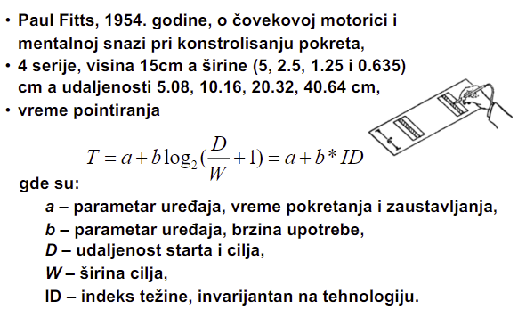
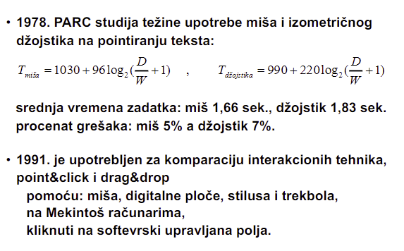
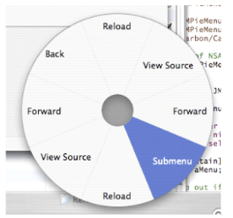
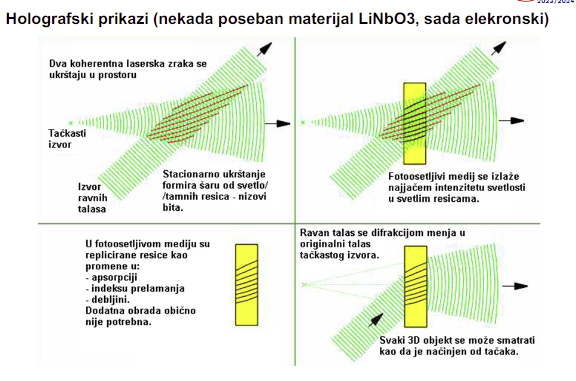
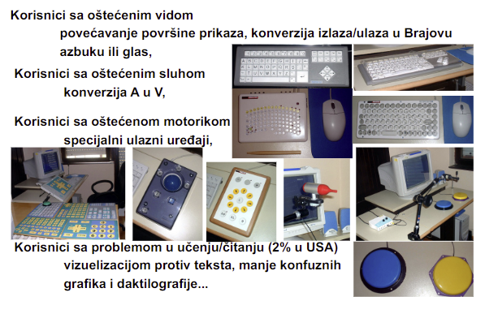

# Predavanje 13

## Pointerski uredjaji
- Sluze za pointiranje (lol)

### Pointerski uredjaji indirektne kontrole 
- Njegov posrednik se dovede na graficki prikaz pa se onda upotrebi (mis - dovedemo kursor na poziciju pa onda upravljamo; touchpad)
- Manje gresaka jer je precizniji (lakse misom pogoditi nesto na ekranu nego jagodicom prsta na touch screen ekranu)
- Mis moze duze da se koristi bez umora ruke (nego touch screen ekran)

##### Svetlosno pero
- Prvi pointerski uredjaj direktne kontrole
- Problem drzanja ruke u istoj poziciji duze vremena
- Kada drzimo ruku duze na istom mestu ona krene da pada pa ono gde pokazujemo krene da "driftuje" ka dole - resenje je bilo dugme koje kada pritisnemo (hold dugme) ostaje pointer na istoj tacki
- Land On tehnika - pogadjam onu tacku na koju spustim ruku - medjutim tesko je pogoditi tacku koju zelimo na ovaj nacin
- Lift Off tehnika - tek kada podignemo ruku onda se selektuje, a ne prilikom pritiska - pomaze pri korekciji problema iznad

##### Ekrani osetljivi na dodir
- Nema vise drzanja pera
- Rezistivni touch senzitivni ekrani - Sastavljeni od vise folija izmedju kojih se nalazi "zele" koji je providan. Kada se pritisne, malo se deformise i menja svoju otpornost i tako se odrazava dodir. Danas se ne koriste
- Danasnji ekrani su zasnovani na kapacitivnim ekranima - Dovoljno je samo da dodirnemo, ne moramo da pritiskamo. Dielektrik izmedju folija je mali kondenzator kome se menja kapacitivnost prilikom dodira pa se tako odrazava dodir
- Lakse je napraviti providne kondenzatore nego providne otpornike. Vise struje treba kod rezistivnog zbog potrosnje struje (povecamo osvetljenost da bi bolje videli providnost)
- Minus kod kapacitivnog je sto npr ne mozemo rukavicama da koristimo jer rukavice ne provode nasu kapacitivnost - zato koristimo stajlus (Strahinjina olovka kao primer stajlusa)
- Bilo je ideja i sa akusticnom implementacijom gde imamo zvucnike pa kada dodirnemo ekran onda prekinemo zvucnike pa se tako odrazi dodir. Problem je buka iz okoline koja moze da smeta
- Rezistivni ekrani su otporniji na hemikalije (npr kod automehanicara, negde napolju...; otproniji su na udarac i jako pritiskanje)
- Mogu reagovati na vise dodira u isto vreme (multi-touch)

### Pointerski uredjaji direktne kontrole 
- Direktno poentiram na ekran bez posrednika (touch screen ekran)
- Intuitivnije za ljude koji su manje upoznati sa tehnologijom
- Mana je sto recimo na touch screen ekranu kada pritiskamo, pokrivamo rukom deo ekrana pa ne vidimo ceo ekran
- Slobodni pokret (crtanje) je dosta laksi kod direktnih (graficka tabla je jedini indirektni uredjaj kod kog je slobodan pokret prirodan)

##### Mis
- Prvo su dolazili sa kuglicom - problem je bio sto udje prasina kod kuglice, tesko je da se izvadi i ocisti
- Pa su posle dosli laserski - problem je sto je neophodna dobra podloga (npr nece raditi na staklu)
- Danas imamo opticke
- Prvo su dolazili sa po 1, 2 i 3 tastera; danas imamo i sa dosta vise tastera; mozemo namestati i tegove u misu da kontrolisemo senzitivnost prilikom kretanja

##### Trackball
- Veca lopta, manje naporno od misa
- Zauzima dosta manje radne povrsine
- Problem je sto opet moze uci prasina i prljavstina unutra
- Moze se lako integrisati u tastaturu/laptop

##### Joystick
- Uzet iz vojske; u obliku palice sa tasterima
- Joypad za konzole i igrice

##### Trackpoint
- Ono crveno malo na thinkpadu (kriminalno beskorisno)
- Mali je, staje izmedju tastera, integrisan na tastaturu
- Mana je sto je poprilicno osetljiv
- Taktilni trackpoint - mozemo osetiti kako kursor prelazi preko nekih povrsina usled iglica koje se nalaze unutar trackpointa; mana je mali zivotni vek i jako je skup

##### Graficka tabla
- Elektronska, akusticna ili kontaktna tabla (ova poslednja vise uopste nije u upotrebi)

##### Touchpad
- Kapacitivni

## Cika Fic
- HCI prica
- Sproveo istrazivanje o motorici i mentalnoj snazi pri kontrolisanju pokreta
- Slike ispod ako nekog zanima

- Ideja je da se pomocu parametara poboljsava kontrola i produktivnost kod koriscenja pointerskog uredjaja
- U sustini, kada na misu stavimo tegove, mi podesavamo ove parametre iznad i prilagodjavamo da nama bude sto bolje
- Dzojstik vs Mis

- Na osnovu Ficovog zakona je predlozen pie meni koji je dosta efikasniji od danasnjeg pravougaonog menija sa opcijama (brzi)

## Monitori
- H-copy - hard copy; stamparska verzija; nesto na sta mogu staviti prst (2D 3D stampac, plotteri)
- I-copy - elektronska verzija
- Monitori su I-copy uredjaji (i projektori, hologramski prikazi, kamera, skeneri (h-copy -> i-copy))

##### CRT
- Cathode ray tube
- Imaju katodu koja se greje da bi imala sto vise elektrona, pa se izbace elektroni i udaraju o fosfor i onda fosfor svetli. Ta boja je uvek jako lepa, ali problem je sto on svetli samo kada ga pogodi elektron pa onda trepce izmedju osvezavanja
- Problem je sto monitor mora biti dosta veci (gabariti su problem)
- Problem sto trosi mnogo struje

##### LCD
- Tecni kristali
- Tanki po gabaritima
- Imaju pozadinsko osvetljenje
- Pali se jedan po jedan piksel s tim sto pikseli mogu da se zadrze da svetle duze
- Umesto pozadinske lampe, stavljene su LED diode pa je nastao LED monitor
- LED moze biti edge lit i back lit
- Kada je ekran crn - trosi jako puno struje; kada priakzuje belo - ne trosi maltene nista struje
- LCD je u pocetku bio jako spor, ali se sada popravilo
- Po lepoti boja nije ni blizu CRT-a ili Plazma monitorima

##### Plazma
- Ogromni prikazi dok zadrzava tanak frame
- Svaki piksel su 3 posude - za svaku od 3 boje. U svakom od posuda se nalazi jedan plemeniti gas. Iznad svake posude se nalaze jedna vertikalna i jedna horizontalna elektroda. Dovede se napon na elektrode i gas podivlja i njegovi joni pobude fosfor u posudama i on svetli (slican koncept kao kod CRT-a)
- Problem je sto vremenom iscuri gas pa ne mozemo da upalimo taj piksel
- Problem je i sto su joni destruktivniji po fosfor od elektrona
- Jako mala potrosnja struje

##### OLED
- Jedna diodica se koristi za jedan piksel
- Savitljivi tanki slojevi - mogu se praviti krivi prikazi
- Problem je sto je skup
- Potrosnja struje je veca od plazme ali manja od LCD-a
- QT tehnika - vrlo brzo sagori piksel jer treba puno hladjenja, kvantna tehnika (nesto o tome?)

##### E-Ink
- Kindle kao primer
- Reflektuju svetlost umesto propustanja svetlosti - trosi gotovo nista struje
- E-ink ne podrzava boje

##### Holografski prikazi
- Poseban materijal koji se moze svetlosno modifikovati - treba se narusti njegova unutrasnja svetlosna resetka
- Treba nam tackasti izvor koji nosi zapise sta treba da prikazemo
- Treba nam izvor ravnih talasa koji stoje (nepokretni)
- Kada se sudare ta dva izvora onda se sabiraju i stvaraju se tackice koje prikazuju ono sto smo hteli
- Stavi se poseban materijal na mesto ukrstanja tih talasa da bi se sacuvao sadrzaj
- Za reprodukciju nam treba isti ravan talas koji ce da udari u memorisano na materijalu i dobicemo ono sto smo hteli
- Problem - zauzima puno prostora

- Prikazuju zaista pravi 3D prikaz

##### Rezolucija
- Preleteo, rekao da samo nije ista kao gustina piksela. Ovde je ubacio u petu brzinu pa je ostatak nikako isprican

## E-copy prikazi

##### Fotoaparat
- Digitalni fotoaparati u sustini, zabeleze ono sto vide elektronski
- HDR - napravi vise istih slika sa razlicitim otvorima (necega na aparatu) i napravice citav range svetlosti onoga sto se zapravo vidi; Problem je kada se sabiraju slike, nece biti detalji istih kvaliteta kao sto bi bilo kod normalne slike

##### Skeneri
- Idu i skeniraju :)
- Svetlost se pomera, odbija se od dokumenta koji se skenira, pogodi citac skenere i on tako skenira
- Transparentni skeneri - svetlost prolazi kroz objekat koji se skenira
- Obicni skeneri su za svakodnevne dokumente, a transparentni su za (valjda medicinu? nista ga nisam razumeo)

##### Projektori
- LCD projektori - nije mogao da emituje bas jaku svetlost
- DLP projektori - cipovi sa ogledalcima (onoliko ogledalaca kolika je rezolucija projektora); jaka svetlost. Danas se koriste laserske diodice

##### VR - AR naocare

## Hard-copy prikazi

##### Stampaci
- Ostavljaju trag na papiru
- Na filozofiju pisacih masina su nastali impact-live stampaci - Cilindar od cvrstog materijala i jedan red malih slova a, pa malih slova b... i tako red po red; 132 komada u jednom redu jer se stampao u A3 formatu. Zatim imamo mastiljavu traku, a sa druge strane 132 elektromagneta kao cekica. Kada je slovo a onda se aktiviraju magneti tamo gde treba da bude slovo a u tom redu. Kada napravi jedan krug po cilindru, onda je zavrsio jedan red. Problem je sto je prikazivao samo tekst (nasa slova nije mogao, grafiku nije mogao da prikaze - ali ASCII art je mogao). Pravio je veliku buku jer je udarao karakter po karakter o papir
- Posle njega dolaze matrix stampaci - Tacka po tacka se formiraju prikazi koje zelimo. Sada mozemo i u boji, ali samo 2 boje. Mnogo je tisi, ali i mnogo sporiji od ovog iznad. Koristan za uplatnice jer moze ocrtati sadrzaj na vise kopija odjednom
- Zatim su dosli termalni stampaci - Rade na slican nacin, ali ne udaraju nego peku. Umesto iglica, imaju male otpornike koji se zagrevaju pa ispeku tackicu na ekranu. Problem je sto trazi specijalan papir, ali moze vise boja da prikaze (prvi stampac u boji). Problem sto vremenom boja nestaje sa njega
- Potom dolaze inkjet stampaci - Pljuckaju boju na papir i tako ostavljaju trag. Ili se termalno greju kapljice (Canon i HP), ili se piezoelektricno kreiraju kapljice (Epson). Trazi kvalitetan papir za kvalitetne graficke prikaze, ali moze i obican papir
- Laserski stampaci - Moze bilo kakav papir, veoma je brz i veoma je precizan. Laser pogadja fotoosetljivi bubanj. Tamo gde ga pogodi, tu se naelektrise bubanj. Tako ide red po red i elektrise ili neelektrise. Toner je jako blizu bubnja i onda naelektrisana mesta na bubnju privlace toner prah (boju). Papir se zagreva da bi istopio prah na sebe (zato papir kada izadje iz stampaca bude malo topao). Kada se zavrsi stampanje, kolektor skuplja visak praha na sebe i razelektrise bubanj. 1 toner je za crno-beli prikaz. 4 tonera za prikaz u boji. Kvalitet boja nije dobar kao kod inkjeta
- 3D stampaci - Prave objekat od paste ili od praha (ili nesto od vode i lasera??)

##### Ploteri
- Reklame na fasadi :)
- Crta kao covek - Ima most koji se pomera i ima ruku zakacenu koja se pomera po mostu. Uzme flomaster odredjene debljine i iscrta sta treba tom bojom te debljine. Ne mora biti ravna povrsina i ravan papir, nego moze biti sta god

## Korisnici sa posebnim potrebama
