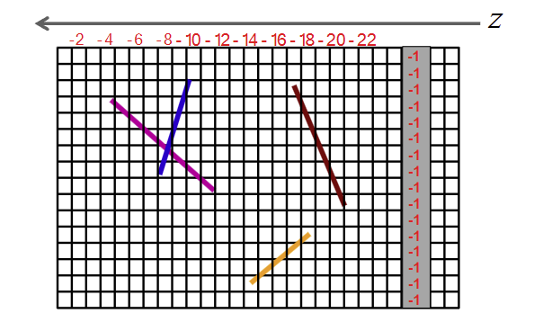
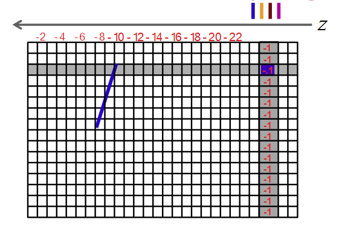
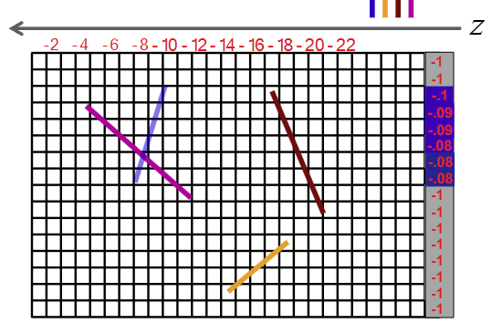
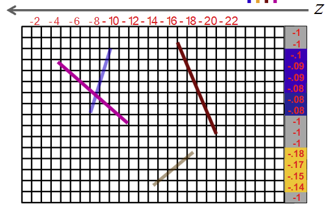
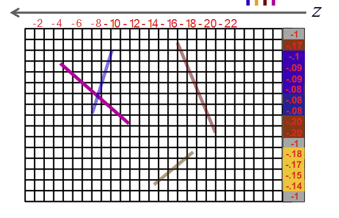
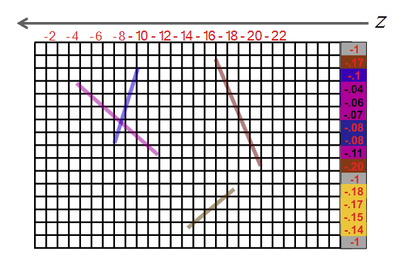
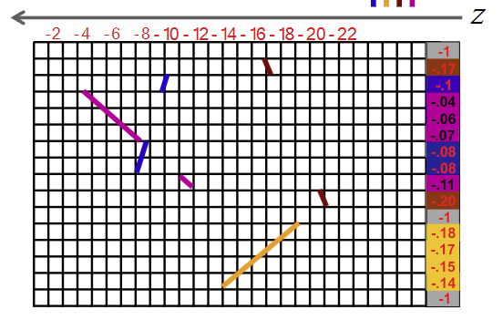
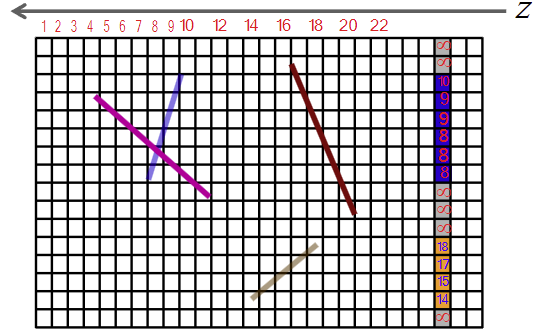
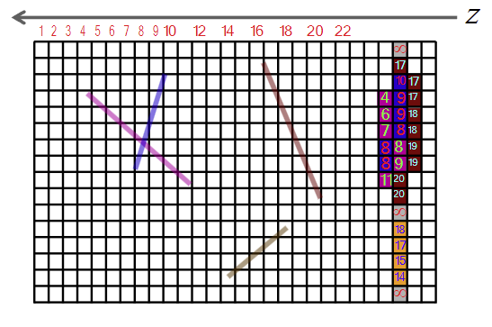
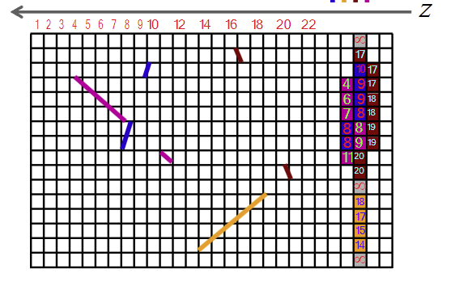

# Predavanje 9

### Image-space culling
- Rade se na nivou piksela
- Ovi algoritmi rade prvenstveno rasterizaciju pa usput sklanjaju skrivene povrsine
- Z-buffer i $\alpha$-buffer su povezani, jer je $\alpha$-buffer modifikacija z-buffer algoritma

##### Z-buffer
- Ideja - Krecem kroz svaki buduci piksel i sta taj piksel vidi to treba da preslikam
- Z-buffer cuva vrednost svakog piksela u redu (za svaki piksel imamo jedan red (kao ray tracing sto ide iz svakog piksela))
- Z-buffer taj red sto cuva salje na prikaz i to radi red po red
- Uzmemo plane ravan i "presecemo" scenu (da bismo imali red piksela na kraju). Dakle vidimo scenu kao linije

*Napomena: Ove vrednosti iznad, fale im tacke. Nije -2 nego -0.02, nije -4 nego -0.-04... -0.2, -0.22*
- Z-buffer je lista vrednosti - jedna vrednost jedan piksel. Inicijalno se settuje sve na -1 jer je -1 beskonacno daleko od kamere (to bi trebalo da se nadovezuje na to da nam je Z osa od -1 do 1?)
- Uzima objekat po objekat (kod nas liniju po liniju)
    - Krece redom kroz elemente bafera
        - Ako nema nista, ostaje ista vrednost
        - Ako ima nesto, onda poredi npr -1 sa -0.1 na slici ispod i pobedjuje -0.1
        - Malo savrseniji algoritmi pored vrednosti mogu i boju da upisu
    
    - Kada zavrsimo plavu liniju dobijamo
    
    - Ponovljeno za oker liniju dobijamo
    
    - Za braon liniju poredimo kada dodjemo do preklapanja: -0.18 vs -0.1 -> pobedjuje -0.1 od plavog objekta
    - Ostala preklapanja uradimo analogno, a tamo gde nema preklapanja poredimo sa -1 i onda pobedi -0.17 i -0.2
    
    - Za ljubicastu ponovimo isto kao za braon. Dobijamo
    
- Na kraju procesa dobijamo sledecu sliku
    
- Moze se paralelizovati da na primer jedan processing unit radi sa plavom, a jedan processing unit sa oker linijom
- Problem je transparentnost - ako je ljubicasti transparentan, mora da se vidi i plavi (veliki minus z-bafera)
- Za i protiv
    - Za:
        - Jednostavan algoritam
        - Za svaku scenu, nema sortiranja
        - Kompleksnost $O(n)$
        - Nema zavisnosti od redosleda poligona
        - Dobar za paralelizaciju
    - Protiv:
        - Zahtevan za memorijom
        - Radi i sa ocigledno skrivenim
        - Nezgodan za antialiasing, transparentnost, foreground/background...

##### $\alpha$-buffer
- Resava problem transparencije tako sto pamti vrednosti boje svih piksela koji se nalaze u redu, ne samo onih koji se "vide"
- Posle plave linije dobijamo

- Medjutim, posle braon i ljubicaste

- Na kraju dobijamo

- Radi isto kao Z-buffer samo sto ne odbacuje dalji element nego memorise boju iza, a za blize elemente memorise boju ispred
- Treba vise vremena (vise memorije) i kompleksniji je
- Zasto ovim baferima treba i boja i udaljenost? - dalji od gledaoca ce imati manje osvetljenu boju, a blizi ce imati vise osvetljenu boju